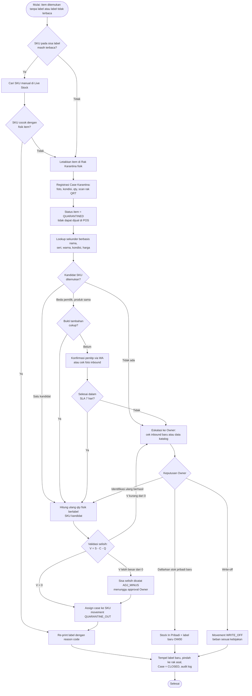
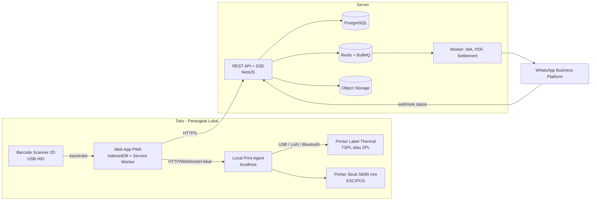
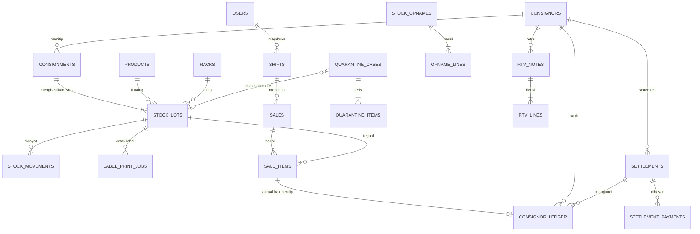

# SRS & PRD — Sistem Semi-WMS & POS Konsinyasi Hot Wheels

> **Software Requirements Specification (SRS) & Product Requirements Document (PRD)**
> Aplikasi web untuk mengelola inventaris gabungan antara stok Hot Wheels milik pribadi dan stok titipan (konsinyasi), dengan label barcode internal, POS kasir offline-first, dan perhitungan bagi hasil (settlement) otomatis.

## Informasi Dokumen

| Atribut | Nilai |
|---|---|
| Nama Dokumen | SRS & PRD — Sistem Semi-WMS & POS Konsinyasi Hot Wheels |
| Versi | 1.0 (Draft untuk review) |
| Tanggal | 24 September 2026 |
| Status | Draft — menunggu persetujuan Owner |
| Disusun oleh | Software Architect, System Analyst, UI/UX Designer |
| Audiens | Owner/Admin Gudang, developer backend & frontend, QA, UI/UX |
| Bahasa | Indonesia (istilah teknis tetap dalam bahasa Inggris) |

### Konvensi Penomoran

| Prefix | Arti |
|---|---|
| `OBJ-xx` | Objective / tujuan produk |
| `BR-xx` | Business Rule (aturan bisnis yang wajib ditegakkan sistem) |
| `DD-xx` | Design Decision (keputusan desain arsitektur/produk) |
| `FR-xxx` | Functional Requirement (prefix modul: `MD`, `IB`, `IC`, `POS`, `RP`, `ST`) |
| `NFR-xx` | Non-Functional Requirement |

### Daftar Isi

1. [System Overview & Core Objectives](#1-system-overview--core-objectives)
2. [User Roles & Permissions](#2-user-roles--permissions)
3. [Business & Technical Flow (Alur Sistem Kritis)](#3-business--technical-flow-alur-sistem-kritis)
4. [Struktur Menu & Breakdown Fitur (Sitemap)](#4-struktur-menu--breakdown-fitur-sitemap)
5. [UI/UX Layouting & Design Guidelines](#5-uiux-layouting--design-guidelines)
6. [Tech Stack & Hardware Integration Notes](#6-tech-stack--hardware-integration-notes)
7. Lampiran: Data Model, API, Acceptance Criteria, Roadmap, Risiko, Asumsi, Glosarium

---

## 1. System Overview & Core Objectives

### 1.1 Latar Belakang & Problem Statement

Toko Hot Wheels yang menjual stok pribadi sekaligus barang titipan menghadapi masalah struktural: **barcode pabrik identik untuk produk yang sama**, sehingga sistem tidak bisa membedakan unit milik siapa yang sedang dipindai.

| # | Masalah di Lapangan | Dampak Bisnis | Solusi dalam Sistem |
|---|---|---|---|
| 1 | Barcode pabrik sama untuk casting/seri yang sama, apa pun pemiliknya | Stok pribadi dan titipan tertukar; bagi hasil salah | Barcode pabrik **diabaikan**; setiap lot inbound mendapat SKU internal unik yang mengandung kode pemilik |
| 2 | Stok pribadi dan titipan bercampur di rak | Sulit audit fisik; klaim penitip tidak bisa diverifikasi | Label wajib sebelum masuk rak; master lokasi rak; opname per rak |
| 3 | Stiker/label tercabut atau rusak | Barang tidak bisa dijual dan kepemilikan hilang | Rak & alur **Karantina** dengan lookup sekunder dan validasi selisih |
| 4 | Skema komisi berbeda per penitip (persen, nett, flat) | Hitungan manual rawan salah dan sengketa | Skema komisi dinamis per SKU, di-*snapshot* saat transaksi |
| 5 | Koneksi internet toko tidak stabil | Kasir berhenti melayani | POS **offline-first** (PWA + IndexedDB) dengan sinkronisasi otomatis |
| 6 | Penitip tidak memiliki bukti tertulis | Sengketa jumlah dan harga | E-receipt WhatsApp saat inbound dan statement settlement berkala |

### 1.2 Tujuan Utama (Core Objectives)

| ID | Tujuan | Metrik Keberhasilan (target awal) |
|---|---|---|
| OBJ-01 | Akurasi kepemilikan stok 100% | 0 penjualan tanpa atribusi pemilik; selisih kepemilikan ≤ 0,5% pada setiap opname |
| OBJ-02 | Inbound cepat dan terstruktur | ≤ 45 detik per baris item (input hingga cetak label) |
| OBJ-03 | Kasir cepat dan tahan gangguan koneksi | Scan-to-cart ≤ 300 ms; checkout 3 item ≤ 15 detik; operasional offline ≥ 8 jam |
| OBJ-04 | Settlement otomatis dan dapat diaudit | Laporan per penitip dihasilkan ≤ 5 menit; 100% selaras dengan ledger |
| OBJ-05 | Keterlacakan penuh | Setiap perubahan stok memiliki movement, aktor, waktu, dan alasan |
| OBJ-06 | Penanganan barang tanpa label yang terkendali | 100% item tanpa label masuk karantina; SLA penyelesaian ≤ 7 hari |

### 1.3 Ruang Lingkup

**In-scope (v1.0)**

- Manajemen penitip, katalog produk, dan lokasi rak.
- Inbound stok pribadi dan titipan, generate SKU, cetak dan cetak ulang label thermal.
- Live stock, karantina, stock opname/adjustment, Return to Consignor (RTV).
- POS kasir berbasis scanner (offline-first), void/refund, shift kasir.
- Settlement penitip, laporan profit pribadi vs fee titipan, audit log.
- Notifikasi WhatsApp (e-receipt inbound, struk, statement settlement).

**Out-of-scope (v1.0)**

- Akuntansi penuh dan pelaporan pajak (hanya ekspor data).
- Integrasi marketplace/e-commerce dan multi-cabang (ditinjau di Fase 3).
- Integrasi langsung mesin EDC/payment gateway (pembayaran non-tunai dicatat manual oleh kasir).
- Pelacakan *serial number* per unit fisik (lihat DD-01).
- Purchase Order dan manajemen supplier lanjutan.

### 1.4 Konsep Dasar Operasional

#### 1.4.1 Pemisahan Aset (Asset Segregation)

Setiap SKU membawa atribut kepemilikan yang **tidak dapat diubah** setelah dibuat (BR-01).

| Atribut | Stok Pribadi (`OWN`) | Stok Titipan (`CONSIGN`) |
|---|---|---|
| Kode pemilik pada SKU | `OW00` | `CNxx` (mis. `CN01`) |
| Hak atas hasil penjualan | 100% milik toko | Penitip menerima porsi sesuai skema; toko menerima fee |
| Biaya perolehan (HPP) | Wajib diisi saat Stock In | Tidak ada (bukan aset toko) |
| Perlakuan nilai stok | Aset toko | Memorandum (di luar aset toko) |
| Pencatatan penjualan | Laba = harga jual − HPP | Akrual utang ke penitip (`consignor_ledger`) + pendapatan fee |
| Barang tidak laku | Tetap stok toko | Return to Consignor (RTV) |
| Badge UI | Biru — `PRIBADI` | Oranye — `TITIP · CNxx` |

**BR-01** Kepemilikan (`owner_code`, `consignor_id`) pada SKU bersifat immutable. Koreksi hanya melalui *Adjustment Reklasifikasi* oleh Owner dengan alasan tertulis dan tercatat di audit log.

#### 1.4.2 Penggantian Barcode Pabrik dengan Label Custom

- Barcode pabrik (UPC/EAN) hanya boleh disimpan sebagai `factory_barcode_ref` yang bersifat informasional, **bukan** kunci lookup transaksi.
- Semua unit wajib berlabel internal sebelum masuk area display (*no label, no shelf*).
- POS menolak input yang berpola barcode pabrik (12–13 digit numerik) dengan pesan: *"Barcode pabrik terdeteksi. Gunakan label internal."*

**Anatomi SKU internal** — contoh `CN01-HW-001`:

| Segmen | Contoh | Arti | Aturan |
|---|---|---|---|
| Kode pemilik | `CN01` | `OW00` = pribadi; `CN` + 2–3 digit = penitip | Dibuat otomatis saat penitip didaftarkan; tidak dipakai ulang |
| Kode kategori | `HW` | Kategori barang (default `HW` = Hot Wheels; dapat diperluas, mis. `MB` untuk Matchbox) | 2–3 huruf kapital, master data |
| Nomor urut | `001` | Urutan lot per kombinasi pemilik + kategori | Auto-increment atomik, minimal 3 digit, meluas otomatis ke 4+ digit; **tidak pernah dipakai ulang** walau SKU di-void |

Regex validasi SKU: `^(OW00|CN\d{2,3})-[A-Z]{2,3}-\d{3,6}$`

**DD-01 — Granularitas SKU = Lot-Line Inbound**
Satu SKU merepresentasikan satu baris inbound (kombinasi: pemilik + produk + kondisi card + kondisi blister + harga jual + skema komisi). Setiap unit fisik menerima **satu stiker dengan SKU yang sama**. Kuantitas dilacak di level SKU; satu kali scan = pengurangan 1 unit.
*Konsekuensi:* unit dalam SKU yang sama saling dapat dipertukarkan tanpa risiko (atributnya identik), sehingga label yang tertukar antar unit satu SKU tidak menimbulkan salah atribusi. Pelacakan *serial per unit* (`CN01-HW-001-U03`) menjadi opsi Fase 3.

**Spesifikasi label (ringkas)** — detail di [Bagian 5.3](#53-halaman-consignment-in) dan [Bagian 6.3](#63-printer-thermal-label):

| Parameter | Nilai |
|---|---|
| Ukuran | 3 × 2 cm (default) atau 4 × 3 cm |
| Simbologi | QR Code Model 2 (ECC level M) sebagai default; Code 128 opsional untuk ukuran 4 × 3 cm pada printer 300 dpi |
| Isi label | SKU (teks human-readable), nama singkat produk, kondisi, harga, kode pemilik. **Nama penitip tidak dicetak** |
| Kode rak | Label rak memakai prefix `RK:` (mis. `RK:A-01-03`) agar tidak tertukar dengan SKU saat scan |

#### 1.4.3 Skema Komisi Dinamis

Komisi ditetapkan **per SKU** saat inbound (default diambil dari profil penitip). Tiga skema didukung:

| Skema | Kode | Parameter | Hak Penitip per Unit | Pendapatan Toko per Unit | Contoh (harga jual Rp50.000) |
|---|---|---|---|---|---|
| Persentase | `PERCENTAGE` | `rate` % (0,01–99,99) | `P − fee` | `fee = round(P × rate)` | 20% → toko Rp10.000; penitip Rp40.000 |
| Nett | `NETT` | `nett_price` (Rp/unit) | `nett_price` | `P − nett_price` | Nett Rp38.000 → toko Rp12.000; penitip Rp38.000 |
| Flat | `FLAT` | `flat_fee` (Rp/unit) | `P − flat_fee` | `flat_fee` | Flat Rp8.000 → toko Rp8.000; penitip Rp42.000 |

Keterangan: `L` = harga list di sistem; `D` = diskon yang dialokasikan ke item; `P = L − D` = harga jual aktual.

**Aturan perhitungan**

- **BR-02 (Versioned terms)** Skema dan harga list bersifat versioned (`terms_version`). Perubahan hanya oleh Owner, berlaku ke depan (tidak retroaktif), dicatat di audit log, dan diberitahukan ke penitip via WhatsApp.
- **BR-03 (Snapshot)** Setiap `sale_item` menyimpan snapshot skema, parameter, HPP, `L`, `D`, `P`, hak penitip, dan fee toko pada saat transaksi. Laporan historis tidak berubah saat skema diubah.
- **BR-04 (Kebijakan diskon)** Parameter `discount_policy` per SKU:
  - `STORE_BEARS` (default): hak penitip dihitung dari `L`; diskon mengurangi pendapatan toko.
  - `SHARED`: hak penitip dihitung dari `P` (diskon ditanggung bersama pada skema `PERCENTAGE`/`FLAT`).
- **BR-05 (Invarian)** `hak_penitip + fee_toko = P` selalu berlaku. Pembulatan (`ROUND_HALF_UP`, satuan Rupiah bulat) diterapkan pada `fee_toko`; hak penitip adalah selisihnya.
- **BR-06 (Guard margin negatif)** Jika `fee_toko < 0` (mis. diskon melebihi fee, atau `P < nett_price`), transaksi diblokir kecuali dengan PIN Owner dan ditandai `negative_margin_flag`.
- **BR-07 (Stok pribadi)** Laba = `P − HPP`. HPP di-snapshot dari SKU.

#### 1.4.4 Prinsip Desain Sistem

| Prinsip | Implementasi |
|---|---|
| Label-first | Tidak ada barang di rak display tanpa label; tidak ada penjualan tanpa SKU tervalidasi (BR-08) |
| Append-only ledger | Perubahan stok hanya melalui `stock_movements`; saldo `qty_on_hand` adalah hasil agregasi yang selalu dapat direkonsiliasi (BR-09) |
| Offline-first | POS membaca dari penyimpanan lokal dan menyinkronkan transaksi secara idempoten |
| Server authoritative | Server adalah sumber kebenaran stok dan ledger; konflik dicatat, bukan disembunyikan |
| Auditable by default | Setiap aksi sensitif (void, diskon, adjustment, reprint, override) mencatat aktor, waktu, alasan, dan nilai sebelum/sesudah |

**BR-08** POS hanya menerima SKU dengan status `AVAILABLE` dan `qty_available ≥ 1`.
**BR-09** `qty_on_hand(SKU) = Σ qty_delta` seluruh movement SKU tersebut; nilai tidak boleh diubah langsung tanpa movement.

---

## 2. User Roles & Permissions

### 2.1 Definisi Role

| Role | Deskripsi | Perangkat Utama |
|---|---|---|
| **Owner / Admin Gudang** | Pemilik usaha atau pengelola gudang dengan akses penuh, termasuk data finansial, komisi, dan persetujuan | Laptop/PC, tablet |
| **Staff / Kasir** | Operator harian: inbound, pelabelan, kasir, penanganan karantina, hitung stok. Tidak dapat melihat data finansial sensitif | PC kasir, tablet, scanner |

> Arsitektur menggunakan RBAC berbasis *permission key* sehingga role tambahan (mis. Gudang-only) dapat ditambahkan tanpa mengubah kode fitur.

### 2.2 Matriks Hak Akses

Legenda: ✅ akses penuh · 👁 hanya lihat · ⚠️ bersyarat (lihat kolom catatan) · ❌ tidak ada akses

| Modul / Fitur | Owner | Staff/Kasir | Catatan |
|---|:---:|:---:|---|
| **Master Data — Penitip** | ✅ | ⚠️ | Staff dapat membuat dan melihat data dasar (nama, WA, kode). Data rekening dan skema default hanya Owner. Tidak ada hapus (hanya arsip oleh Owner) |
| **Master Data — Katalog Produk** | ✅ | ⚠️ | Staff dapat *quick-add* produk baru dengan flag `needs_review`; edit dan hapus hanya Owner |
| **Master Data — Lokasi Rak** | ✅ | 👁 | |
| **Inbound — Stock In Pribadi** | ✅ | ⚠️ | Staff hanya dapat membuat draft tanpa HPP; Owner mengisi HPP dan melakukan commit |
| **Inbound — Consignment In** | ✅ | ✅ | Staff memakai skema default penitip; mengubah skema/harga di luar default butuh PIN Owner |
| **Inbound — Void Consignment** | ✅ | ❌ | Hanya jika belum ada penjualan atas SKU terkait |
| **Print label pertama kali** | ✅ | ✅ | |
| **Re-print label** | ✅ | ⚠️ | Wajib alasan; Staff maksimal 3× per SKU per hari, selebihnya PIN Owner |
| **Live Stock** | ✅ | 👁 | Staff tidak melihat HPP, skema komisi, dan identitas lengkap penitip (hanya kode `CNxx`) |
| **Karantina — registrasi & pencarian** | ✅ | ✅ | |
| **Karantina — penyelesaian kasus** | ✅ | ⚠️ | Staff boleh menutup kasus hanya jika kandidat tunggal tanpa ambiguitas pemilik dan selisih = 0; selain itu wajib approval Owner |
| **Karantina — write-off / reklasifikasi** | ✅ | ❌ | |
| **Stock Opname — hitung (scan)** | ✅ | ✅ | Staff memakai *blind count* (qty sistem disembunyikan) |
| **Stock Opname — approval adjustment** | ✅ | ❌ | |
| **RTV** | ✅ | ⚠️ | Staff membuat draft dan melakukan verifikasi scan; eksekusi oleh Owner |
| **POS — transaksi** | ✅ | ✅ | |
| **POS — diskon** | ✅ | ⚠️ | Batas diskon Staff dikonfigurasi (default 0% → wajib PIN Owner) |
| **POS — override harga** | ✅ | ❌ | |
| **POS — void item sebelum bayar** | ✅ | ✅ | |
| **POS — void/refund setelah bayar** | ✅ | ⚠️ | Wajib PIN Owner dan alasan |
| **POS — buka/tutup shift** | ✅ | ✅ | Selisih kas di atas ambang batas butuh persetujuan Owner |
| **Panel laba di POS** | ✅ | ❌ | Disembunyikan di level API, bukan hanya CSS |
| **Laporan — Consignor Settlement** | ✅ | ❌ | |
| **Laporan — Profit Margin Pribadi vs Fee** | ✅ | ❌ | |
| **Laporan — Penjualan harian (ringkas)** | ✅ | 👁 | Staff hanya melihat shift miliknya, tanpa laba |
| **Audit Log** | ✅ | ❌ | |
| **Pengaturan — Pengguna & Role** | ✅ | ❌ | |
| **Pengaturan — Printer/Scanner/WA/Parameter** | ✅ | ⚠️ | Staff hanya dapat *test print* di terminalnya |
| **Ekspor data & backup** | ✅ | ❌ | |

### 2.3 Aturan Otorisasi Khusus

| ID | Aturan | Implementasi |
|---|---|---|
| FR-AUTH-01 | **PIN Owner override** — aksi sensitif oleh Staff diotorisasi PIN Owner tanpa logout Staff | PIN 6 digit, disimpan hash (Argon2id), rate limit 5 percobaan lalu kunci 5 menit; setiap override menyimpan `approved_by`, `reason`, dan `action` |
| FR-AUTH-02 | **Data masking** | Field HPP, skema, rekening, dan laba **tidak dikirim** oleh API ke response role Staff |
| FR-AUTH-03 | **Sesi** | Access token pendek (15 menit) + refresh token; idle-lock layar POS setelah 5 menit (dibuka dengan PIN kasir); POS offline memakai *device token* dengan masa berlaku ≤ 24 jam |
| FR-AUTH-04 | **Audit log** | Semua aksi ubah data menyimpan `who, when, device_id, action, entity, before, after, reason`; log bersifat append-only |
| FR-AUTH-05 | **Pemisahan tugas** | Pembuat draft adjustment/RTV tidak boleh menjadi penyetuju yang sama pada kasus yang sama (kecuali Owner tunggal, dengan flag `self_approved`) |

---

## 3. Business & Technical Flow (Alur Sistem Kritis)

### 3.0 Referensi Umum: Status dan Movement

**Status SKU (`stock_lots.status`)**

| Status | Arti | Dapat dijual di POS? |
|---|---|:---:|
| `AVAILABLE` | Stok tersedia (qty_on_hand > 0) | ✅ |
| `SOLD_OUT` | Qty = 0 setelah penjualan | ❌ |
| `RETURNED` | Seluruh sisa dikembalikan ke penitip (RTV) | ❌ |
| `WRITTEN_OFF` | Dihapus karena hilang/rusak (disetujui Owner) | ❌ |
| `VOID` | Dibatalkan sebelum ada penjualan (inbound salah) | ❌ |

> Item fisik tanpa label **bukan** status SKU; ia dicatat sebagai `quarantine_items` yang belum terikat ke SKU mana pun (lihat 3.3).

**Tipe movement (`stock_movements.type`)**

| Tipe | Delta Qty | Pemicu |
|---|:---:|---|
| `IN_OWN` | + | Stock In Pribadi |
| `IN_CONSIGN` | + | Consignment In |
| `SALE` | − | Penjualan POS |
| `SALE_VOID` | + | Void transaksi |
| `RETURN_CUSTOMER` | + | Refund/retur pembeli (kondisi layak jual) |
| `RTV` | − | Return to Consignor |
| `ADJ_PLUS` / `ADJ_MINUS` | ± | Hasil opname / karantina / koreksi |
| `WRITE_OFF` | − | Hilang/rusak permanen |
| `TRANSFER` | 0 | Pindah rak (mengubah `rack_id`, bukan qty) |
| `QUARANTINE_IN` | 0 | Registrasi item tanpa label (informasional; SKU asal belum diketahui) |
| `QUARANTINE_OUT` | 0 | Case karantina di-assign ke SKU (penutupan kasus) |

---

### 3.1 Flow Inbound (Consignment In)

**Tujuan:** menerima barang titipan secara terverifikasi, memberi identitas unik, dan menghasilkan bukti terima.
**Aktor:** Staff/Kasir (pelaksana), Penitip (pihak luar), Sistem, Owner (override).

| # | Aktor | Langkah Operasional | Logika Teknis & Validasi |
|---|---|---|---|
| 1 | Penitip & Staff | Penitip membawa barang; Staff membuka **Inbound → Consignment In → Baru**. | Sistem membuat `consignments` berstatus `DRAFT` dengan `draft_id` (UUID). Auto-save draft ke server tiap 10 detik (debounce); jika offline, disimpan di IndexedDB. |
| 2 | Staff | Memilih penitip (cari nama/kode/WA) atau membuat penitip baru (*quick-create*). | WA divalidasi format E.164 (`+62…`) dan unik. Penitip baru otomatis mendapat kode `CNxx` berikutnya. Checkbox **opt-in WhatsApp** wajib dicentang agar e-receipt dapat dikirim. Skema default dimuat dari profil penitip. |
| 3 | Staff | Menghitung fisik dan mengelompokkan per kombinasi produk + kondisi + harga. | Aturan pengelompokan (DD-01): satu baris = satu kombinasi *(produk, kondisi card, kondisi blister, harga jual, skema)*. Beda satu atribut → baris terpisah. |
| 4 | Staff | Mengisi baris item pada **bulk grid**: produk (autocomplete katalog/quick-add), kondisi, qty, harga jual, rak tujuan. | `qty` integer 1–999. Harga ≥ Rp1.000 dan kelipatan Rp500 (konfigurabel). Peringatan duplikat jika ada baris dengan kombinasi identik. Produk quick-add ditandai `needs_review`. |
| 5 | Staff | Menghitung ulang fisik dan mencentang **"Qty fisik sudah diverifikasi"**; mengisi `qty_claimed` jika berbeda dengan klaim penitip. | `qty_received` menjadi sumber kebenaran. Selisih vs `qty_claimed` disimpan dan dicantumkan di e-receipt. Commit diblokir jika checkbox belum dicentang. |
| 6 | Staff / Owner | Menetapkan skema komisi per baris: **Persentase / Nett / Flat**. | Default dari penitip. Validasi: `PERCENTAGE` 0,01–99,99; `NETT` 0 < nett < harga jual; `FLAT` 0 < flat < harga jual. Override oleh Staff memerlukan PIN Owner. Disimpan sebagai `terms_version = 1`. |
| 7 | Staff | Klik **Commit & Generate SKU**. | Satu transaksi DB (lihat pseudocode di bawah): buat `consignment_no` (`CI-YYYYMMDD-NNNN`), generate SKU tiap baris, insert `stock_lots` dan `stock_movements(IN_CONSIGN)`. Status → `COMMITTED`. Setelah commit, pemilik/qty/skema **terkunci** (BR-01). Gunakan `Idempotency-Key` agar retry akibat koneksi putus tidak menggandakan data. |
| 8 | Staff | Klik **Cetak Label** per baris atau **Cetak Semua**. | Backend membuat `label_print_jobs` (default `copies = qty_received`), merender TSPL/ZPL, mengirim ke Print Agent. Status job: `QUEUED → SENT → CONFIRMED / FAILED`. Karena printer thermal memberi umpan balik terbatas, tersedia tombol **"Label tercetak benar?"**. Counter `labels_printed` diperbarui saat `CONFIRMED`. |
| 9 | Staff | Menempel stiker pada kemasan (posisi standar operasional) dan menaruh barang di rak. Opsional: scan `RK:` rak lalu scan label untuk *put-away*. | Put-away memperbarui `rack_id` dan mencatat movement `TRANSFER`. Jika dilewati, rak = rak tujuan yang diinput di baris. |
| 10 | Sistem | Mengirim **e-receipt WhatsApp** ke penitip. | Job `notification` masuk antrean (BullMQ). Template `consignment_receipt` berisi ringkasan + tautan detail bertoken (kedaluwarsa 30 hari). Status: `PENDING → SENT → DELIVERED → READ / FAILED`. Retry exponential backoff (1m, 5m, 30m, 2j, 6j). Gagal permanen → notifikasi ke Staff + fallback tautan `wa.me` untuk kirim manual. |
| 11 | Sistem | Menutup dokumen. | Status `COMPLETED` bila semua label `CONFIRMED`. Jika `labels_printed < qty_received` lebih dari 30 menit setelah commit, dashboard menampilkan peringatan **"Belum berlabel"**. |

**Pseudocode generate SKU (atomik, bebas nomor ganda)**

```sql
BEGIN;

-- 1) Pastikan baris sequence ada
INSERT INTO sku_sequences(owner_code, category_code, last_seq)
VALUES ('CN01', 'HW', 0)
ON CONFLICT (owner_code, category_code) DO NOTHING;

-- 2) Increment atomik. UPDATE ... RETURNING mengunci baris,
--    sehingga commit paralel dari dua kasir akan diserialkan.
UPDATE sku_sequences
   SET last_seq = last_seq + 1
 WHERE owner_code = 'CN01' AND category_code = 'HW'
RETURNING last_seq;                          -- contoh: 1

-- 3) Bentuk SKU (padding minimal 3 digit)
--    sku := owner_code || '-' || category_code || '-' || lpad(last_seq::text, 3, '0')
--    => 'CN01-HW-001'

-- 4) INSERT stock_lots (UNIQUE(sku)) + INSERT stock_movements(type='IN_CONSIGN', qty_delta=qty_received)
-- 5) Ulangi untuk setiap baris, urut berdasarkan line_no

COMMIT;   -- gagal di titik mana pun => ROLLBACK penuh (tidak ada SKU setengah jadi)
```

Catatan: celah nomor (*gap*) akibat rollback diperbolehkan; nomor SKU **tidak pernah dipakai ulang**.

**Template e-receipt WhatsApp (kategori utility)**

```text
*Bukti Terima Titipan — {{1}}*
No. Dokumen : {{2}}
Penitip     : {{3}} ({{4}})
Tanggal     : {{5}}
Total       : {{6}} item / {{7}} pcs

Rincian lengkap (skema komisi, harga, dan SKU):
{{8}}

Simpan pesan ini sebagai bukti. Balas jika ada ketidaksesuaian.
```

**Penanganan error Inbound**

| Kondisi | Perilaku Sistem |
|---|---|
| Koneksi putus saat commit | Draft aman (IndexedDB); retry dengan `Idempotency-Key` yang sama |
| Printer offline / tinta habis | Job `FAILED`, tombol *Coba lagi*; fallback cetak PDF via browser |
| WhatsApp gagal terkirim | Retry otomatis; fallback `wa.me` manual; dokumen tetap `COMPLETED` |
| Salah input setelah commit | Owner dapat **Void Consignment** jika belum ada penjualan; movement dibalik; SKU ditandai `VOID` dan nomor tidak dipakai ulang |
| Qty fisik ≠ klaim penitip | Dicatat sebagai `variance_note`; ditampilkan di e-receipt |

---

### 3.2 Flow POS (Penjualan Offline)

**Tujuan:** transaksi cepat berbasis scan; kepemilikan terdeteksi otomatis; stok terpotong; pembagian laba terekam.
**Aktor:** Kasir, Pembeli, Sistem.

| # | Aktor | Langkah Operasional | Logika Teknis & Validasi |
|---|---|---|---|
| 1 | Kasir | Login, lalu **Buka Shift** (input kas awal). | Membuat `shifts` (`device_id`, `opening_cash`). Perangkat mengunduh *snapshot* katalog jual: `GET /pos/snapshot?cursor=…` → disimpan di IndexedDB (`sellable_skus`: SKU, nama, kondisi, `L`, qty, `owner_code`, terms). Sinkronisasi delta berikutnya lewat SSE/WebSocket. |
| 2 | Kasir | Layar POS terbuka dengan kolom scan **auto-focus**. | Lihat aturan fokus & deteksi scanner di 5.2. |
| 3 | Kasir | Memindai stiker pada kemasan. | Scanner (HID keyboard wedge) mengirim karakter + Enter. Input diklasifikasikan: (a) cocok regex SKU → lookup; (b) prefix `RK:` → abaikan/peringatan; (c) 12–13 digit numerik → tolak sebagai barcode pabrik; (d) lainnya → *SKU tidak dikenal*. |
| 4 | Sistem | **Lookup** SKU dan **deteksi kepemilikan**. | *Local-first*: baca IndexedDB (< 10 ms). Tampilkan badge `PRIBADI` atau `TITIP · CNxx`, nama, kondisi, harga, dan stok tersisa. Terms (skema, `terms_version`) dimuat ke keranjang sebagai snapshot sementara. |
| 5 | Sistem | Validasi dan tambah ke keranjang. | BR-08: status `AVAILABLE` dan `qty_available_local − qty_in_cart ≥ 1`. Scan SKU yang sama menambah qty +1. Bunyi sukses / bunyi error berbeda. |
| 6 | Kasir | (Opsional) ubah qty, hapus item, diskon, *hold* transaksi. | Diskon Staff di atas batas → PIN Owner. Validasi BR-06 (margin negatif). Keranjang disimpan ke IndexedDB pada setiap perubahan agar selamat dari mati listrik/refresh. |
| 7 | Kasir | Memilih pembayaran (Tunai/QRIS/Transfer/Debit/split) dan **Bayar**. | Validasi total tender ≥ total. Untuk non-tunai, kasir memasukkan nomor referensi. Hitung kembalian. |
| 8 | Sistem | **Finalisasi lokal**. | Tulis `pending_sales` ke IndexedDB dengan `client_sale_id` (UUID) dan nomor struk `POS-{DEVICE}-{YYYYMMDD}-{SEQ}`; kurangi qty lokal; cetak struk (ESC/POS). Transaksi selesai bagi pembeli **tanpa menunggu server**. |
| 9 | Sistem | **Sinkronisasi ke server**. | `POST /pos/sales/batch` (idempoten via `client_sale_id`). Retry dengan backoff; Background Sync API jika tersedia. Indikator antrean sinkron di header. |
| 10 | Server | **Potong stok & rekam bagi hasil** dalam satu transaksi. | Lihat blok "Pemrosesan Server" di bawah. |
| 11 | Sistem | Mengirim struk (opsional) dan menutup shift. | Struk WA jika pembeli memberi nomor. **Tutup Shift** diblokir bila masih ada `pending_sales` belum tersinkron (kecuali override Owner). Selisih kas dihitung: `closing_cash − (opening_cash + Σ tunai)`. |

**Pemrosesan Server per `sale_item`**

```text
BEGIN
  1. Dedup: jika client_sale_id sudah ada → kembalikan hasil sebelumnya (idempoten)
  2. Untuk tiap item:
     a. UPDATE stock_lots SET qty_on_hand = qty_on_hand - :qty WHERE id = :lot_id
        (baris terkunci; jika hasil < 0 → tetap diterima karena barang fisik sudah terjual,
         tandai sale.flag = 'SYNC_CONFLICT' untuk ditinjau Owner)
     b. INSERT stock_movements(type='SALE', qty_delta = -:qty, ref = sale_id)
     c. Hitung split dengan snapshot terms dari perangkat:
          - OWN     : profit_toko = P - HPP
          - CONSIGN : fee_toko per skema (BR-04/05), hak_penitip = P - fee_toko
     d. INSERT sale_items (snapshot lengkap: L, D, P, scheme, params, HPP, fee_toko, hak_penitip, terms_version)
     e. Jika CONSIGN: INSERT consignor_ledger(type='SALE_ACCRUAL', amount=+hak_penitip, sale_item_id)
     f. Jika terms_version perangkat < versi server → tandai 'TERMS_STALE' (tinjauan Owner)
     g. Jika qty_on_hand = 0 → status = 'SOLD_OUT'
  3. Simpan pembayaran, hubungkan ke shift
COMMIT → publish event (SSE) ke dashboard Owner & perangkat lain (refresh qty)
```

**Contoh perhitungan bagi hasil satu keranjang**

| SKU | Pemilik | Skema | Qty | Harga `L` | Bruto | Hak Penitip | Pendapatan Toko | Keterangan |
|---|---|---|:---:|---:|---:|---:|---:|---|
| `OW00-HW-014` | Pribadi | — | 1 | 60.000 | 60.000 | 0 | 60.000 | HPP 35.000 → laba 25.000 |
| `CN01-HW-003` | CN01 | 20% | 2 | 45.000 | 90.000 | 72.000 | 18.000 | fee 9.000/unit |
| `CN02-HW-007` | CN02 | Nett 38.000 | 1 | 50.000 | 50.000 | 38.000 | 12.000 | |
| `CN03-HW-002` | CN03 | Flat 8.000 | 1 | 55.000 | 55.000 | 47.000 | 8.000 | |
| **Total** | | | **5** | | **255.000** | **157.000** | **98.000** | Laba toko setelah HPP: 98.000 − 35.000 = **63.000** |

**Void, refund, dan retur**

| Kasus | Perlakuan |
|---|---|
| Void item sebelum bayar | Hapus dari keranjang; tidak ada efek stok |
| Void transaksi setelah bayar | PIN Owner + alasan. Movement `SALE_VOID` (+), `consignor_ledger` entri pembalik (`REFUND_REVERSAL`, negatif), transaksi asal ditandai `VOIDED` (tidak dihapus) |
| Retur pembeli | Barang layak jual dilabeli ulang bila perlu, masuk kembali dengan `RETURN_CUSTOMER`; barang rusak → `ADJ_MINUS`/`WRITE_OFF` sesuai kebijakan tanggung jawab |
| Void setelah periode settlement dibayar | Entri pembalik menjadi saldo negatif penitip dan dibawa ke periode berikutnya (*carry-over*) |

**Edge case POS**

| Kondisi | Respons Sistem |
|---|---|
| SKU tidak ditemukan | Banner merah + bunyi error + tombol **"Kirim ke Karantina"** |
| Barcode pabrik terdeteksi | Tolak: "Gunakan label internal" |
| Stok 0 / `SOLD_OUT` | Tolak; sarankan cek **Live Stock** (kemungkinan salah hitung → alur Karantina/Opname) |
| SKU berstatus `RETURNED`/`WRITTEN_OFF`/`VOID` | Tolak dengan alasan status |
| Scan ganda < 300 ms (double-trigger) | Diabaikan sebagai duplikat pemicu; scan yang disengaja (interval lebih lama) menambah qty |
| Harga di server berubah saat offline | Harga yang tampil ke pembeli tetap berlaku; server menandai `TERMS_STALE` untuk tinjauan Owner |
| Dua kasir menjual unit terakhir bersamaan | Kedua transaksi diterima; stok −1 → `SYNC_CONFLICT`; Owner menindaklanjuti lewat opname |
| Mati listrik saat checkout | Keranjang dipulihkan dari IndexedDB; transaksi belum final tidak tercatat |
| Printer struk offline | Transaksi tetap final; tombol **Cetak Ulang Struk** |
| Manual search (label tak terbaca) | Diizinkan hanya via *Pilih SKU* dengan badge pemilik; dicatat `input_method = MANUAL` dan muncul di laporan anomali |

---

### 3.3 Flow Karantina (Unidentified Stock)

**Tujuan:** menangani barang fisik yang labelnya tercabut/rusak/tidak terbaca tanpa mengorbankan akurasi kepemilikan.
**Aktor:** Staff, Owner, Penitip (untuk verifikasi bila ambigu).

| # | Aktor | Langkah Operasional | Logika Teknis & Validasi |
|---|---|---|---|
| 1 | Staff | Menemukan item tanpa label (di display, saat opname, atau retur pembeli). **Cek cepat:** apakah sisa label masih memuat SKU yang terbaca? | Jika SKU terbaca dan cocok dengan fisik → *jalur cepat*: cari SKU di Live Stock → langsung **Re-print label** (reason `LABEL_DAMAGED`), selesai. |
| 2 | Staff | Jika SKU tidak terbaca: **tarik fisik ke Rak Karantina** (rak fisik khusus, label `RK:QRT-01`). | Item tanpa label tidak pernah dijual atau dikembalikan ke display sebelum teridentifikasi (BR-10). |
| 3 | Staff | **Registrasi Case Karantina** di sistem: foto, nama/keyword, seri, warna, kondisi card/blister, qty; scan rak karantina. | Membuat `quarantine_cases` (`QC-YYYYMMDD-NNN`, status `OPEN`) dan `quarantine_items`. Movement `QUARANTINE_IN` bersifat **informasional** (stok SKU belum dikurangi karena SKU asal belum diketahui). |
| 4 | Sistem | **Lookup sekunder** berbasis atribut. | Pencarian ke `stock_lots` berstatus `AVAILABLE`: fuzzy nama (`pg_trgm`, ambang similarity ≥ 0,3), filter seri/warna/kondisi/rentang harga/penitip. Peringkat kandidat berdasarkan skor kecocokan + kemungkinan kehilangan label (mis. SKU dengan riwayat scan terakhir lama). |
| 5 | Staff | Menilai kandidat. **Deteksi ambiguitas pemilik:** apakah ≥ 2 kandidat dengan produk & kondisi identik namun pemilik berbeda? | Jika ya → bukti tambahan diperlukan (foto inbound, harga tertera, konfirmasi penitip via WA). Tidak boleh ditetapkan berdasarkan nama saja (BR-11). SLA 7 hari; lewat SLA → eskalasi Owner. |
| 6 | Staff | Memilih kandidat SKU dan **menghitung ulang fisik berlabel** SKU tersebut di seluruh rak (input `C`). | Sistem mencatat `counted_at` dan mengambil `S` = `qty_on_hand` SKU **pada waktu `counted_at`** (dihitung dari ledger movement) agar penjualan yang terjadi saat menghitung tidak merusak validasi. |
| 7 | Sistem | **Validasi selisih stok.** | `V = S − (C + Q)`; `Q` = jumlah unit karantina yang di-assign. Hasil: **V = 0** → rekonsiliasi bersih. **V > 0** → unit hilang (dibuat `ADJ_MINUS` menunggu approval Owner). **V < 0** → unit lebih banyak dari catatan; assign **ditolak otomatis** dan dieskalasi (kemungkinan milik SKU lain atau belum tercatat). |
| 8 | Staff / Owner | **Assign & tutup**: Sistem membuat `QUARANTINE_OUT`, meng-assign case ke SKU. | Kasus dengan V = 0 dan kandidat tunggal dapat ditutup Staff; selainnya Owner. Keputusan Owner untuk kasus buntu: (a) identifikasi ulang, (b) **daftarkan sebagai stok pribadi baru** (Stock In `OW00` + label baru), atau (c) **write-off** (beban sesuai kebijakan tanggung jawab). |
| 9 | Staff | **Re-print label** untuk seluruh unit yang teridentifikasi. | `label_print_jobs` dengan `reason = LABEL_LOST`/`LABEL_DAMAGED`; `reprint_count` bertambah; jumlah cetak tidak boleh melebihi `Q` (kecuali PIN Owner). |
| 10 | Staff | Tempel label, pindahkan ke rak asal (scan `RK:` + scan label). | Movement `TRANSFER`; case `CLOSED`; audit log lengkap (foto, kandidat, keputusan, approver). |

**Aturan bisnis karantina**

- **BR-10** Item di rak karantina tidak dapat dijual, dikembalikan ke penitip (RTV), atau dipindah ke display.
- **BR-11** Assign berdasarkan nama saja dilarang bila terdapat ≥ 2 pemilik dengan produk & kondisi identik; wajib ada bukti pendukung tercatat.
- **BR-12** Setiap case memiliki aging: > 3 hari → badge kuning; > 7 hari → merah dan notifikasi Owner.
- **BR-13** Karena granularitas SKU = lot (DD-01), label baru menggunakan SKU yang **sama**; tidak ada risiko unit tertukar dalam SKU yang sama.

**Diagram alur Karantina**



---

### 3.4 Flow Consignor Settlement

**Tujuan:** menghitung hak penitip dari item terjual, memotong fee toko, dan mencatat pembayaran secara auditable.
**Aktor:** Owner (pelaksana dan approver), Sistem, Penitip (penerima).

**Model data konseptual:** setiap penjualan item titipan menghasilkan entri `consignor_ledger` (akrual hak penitip). Saldo penitip dapat dilihat *real-time*; **Settlement** adalah proses mengunci sekumpulan entri ledger menjadi satu statement lalu membayarnya.

| # | Aktor | Langkah Operasional | Logika Teknis & Validasi |
|---|---|---|---|
| 1 | Owner | Buka **Laporan & Keuangan → Consignor Settlement → Buat Settlement**; pilih penitip (atau semua), periode, dan tanggal cut-off. | Siklus per penitip (mingguan/2-mingguan/bulanan) diambil dari profil sebagai default. Periode tidak boleh tumpang tindih dengan settlement `APPROVED`/`PAID` milik penitip yang sama. |
| 2 | Sistem | **Kalkulasi item terjual** per penitip. | Query entri ledger `settlement_id IS NULL`, `sold_at ≤ cut-off`, tanpa transaksi `VOIDED`. Agregasi per SKU: qty, bruto `ΣP`, fee toko, hak penitip. Termasuk entri negatif (refund) dan adjustment. |
| 3 | Sistem | **Potong fee** dan hitung neto. | `Net Payable = Σ hak_penitip − Σ refund/reversal − Σ adjustment yang dibebankan ± carry-over saldo sebelumnya`. Fee sudah di-snapshot per item, sehingga perubahan skema tidak memengaruhi hasil (BR-03). |
| 4 | Owner | **Review** rincian per SKU dan per transaksi; lampirkan catatan/adjustment manual (dengan alasan). | Adjustment membuat entri ledger baru bertipe `ADJUSTMENT`; tidak ada edit langsung pada baris penjualan. Ekspor PDF/Excel tersedia. |
| 5 | Owner | **Approve**. | Dalam satu transaksi: `UPDATE consignor_ledger SET settlement_id = :id WHERE settlement_id IS NULL AND …` dan `RETURNING` — menjamin tidak ada entri yang masuk dua settlement (anti double-settle). Status `APPROVED`; baris menjadi immutable. Jika `Net Payable < ambang minimum payout` → ditahan (*carry-over*). |
| 6 | Sistem | Mengirim **statement** via WhatsApp (PDF/tautan bertoken). | Status `SENT`. Statement memuat rincian SKU, harga, skema, fee, dan saldo. |
| 7 | Owner | **Proses pembayaran**: metode (tunai/transfer/e-wallet), tanggal, nomor referensi, bukti bayar (unggah foto). | Membuat `settlement_payments` dan entri ledger `SETTLEMENT_PAYMENT` (negatif). Mendukung pembayaran parsial → `PARTIALLY_PAID`; sisa menjadi saldo. |
| 8 | Sistem | **Tutup** settlement. | Status `PAID` → `CLOSED`. Sistem menampilkan rekomendasi RTV untuk SKU titipan yang aging > N hari (konfigurabel) dan belum laku. |

**Status settlement:** `DRAFT → APPROVED → SENT → PARTIALLY_PAID / PAID → CLOSED` (`CANCELLED` hanya dari `DRAFT`).

**Contoh statement penitip `CN01` — periode 1–30 September 2026**

| SKU | Skema | Terjual | Harga | Bruto | Fee Toko | Hak Penitip |
|---|---|:---:|---:|---:|---:|---:|
| `CN01-HW-003` | 20% | 10 | 45.000 | 450.000 | 90.000 | 360.000 |
| `CN01-HW-005` | Flat 8.000 | 6 | 55.000 | 330.000 | 48.000 | 282.000 |
| `CN01-HW-008` | Nett 38.000 | 4 | 50.000 | 200.000 | 48.000 | 152.000 |
| **Subtotal** | | **20** | | **980.000** | **186.000** | **794.000** |
| Refund (1 unit `CN01-HW-003`, `REFUND_REVERSAL`) | | | | | | −36.000 |
| **Net Payable** | | | | | | **758.000** |

Verifikasi invarian: `794.000 + 186.000 = 980.000` ✔.

**Aturan bisnis settlement**

- **BR-14** Entri ledger yang sudah terikat `settlement_id` tidak dapat diubah atau dihapus; koreksi dilakukan dengan entri pembalik pada periode berikutnya.
- **BR-15** Tanggung jawab kehilangan/kerusakan (`loss_liability`: `STORE` / `CONSIGNOR` / `SHARED`) mengikuti perjanjian penitip dan menentukan apakah `WRITE_OFF` SKU titipan menghasilkan entri `ADJUSTMENT` negatif ke penitip.
- **BR-16** Settlement tidak dapat di-*approve* jika terdapat kasus Karantina `OPEN` yang terkait SKU penitip tersebut, kecuali Owner mem-*override* dengan catatan.

---

## 4. Struktur Menu & Breakdown Fitur (Sitemap)

### 4.1 Hierarki Menu

```text
Dashboard
├── 1. Master Data
│   ├── 1.1 Data Penitip
│   ├── 1.2 Katalog Produk
│   └── 1.3 Lokasi Rak
├── 2. Inbound
│   ├── 2.1 Stock In Pribadi
│   ├── 2.2 Consignment In
│   └── 2.3 Print / Re-print Label Barcode
├── 3. Inventory Control
│   ├── 3.1 Live Stock
│   ├── 3.2 Menu Karantina
│   ├── 3.3 Stock Opname / Adjustment
│   └── 3.4 Return to Consignor (RTV)
├── 4. POS (Point of Sale)
│   ├── 4.1 Kasir
│   ├── 4.2 Riwayat Transaksi (Void / Refund / Cetak Ulang Struk)
│   └── 4.3 Shift Kasir
├── 5. Laporan & Keuangan
│   ├── 5.1 Consignor Settlement
│   ├── 5.2 Profit Margin: Pribadi vs Fee Titipan
│   ├── 5.3 Laporan Penjualan & Stok
│   └── 5.4 Audit Log
└── 6. Pengaturan
    ├── 6.1 Pengguna & Role
    ├── 6.2 Perangkat (Printer & Scanner)
    ├── 6.3 Template Notifikasi WhatsApp
    └── 6.4 Parameter Sistem
```

**Dashboard (beranda)** — kartu ringkas: penjualan hari ini, item belum berlabel, kasus karantina terbuka (dengan aging), stok menipis, settlement jatuh tempo, antrean notifikasi gagal. Kartu keuangan hanya tampil untuk Owner.

---

### 4.2 Master Data

#### 1.1 Data Penitip

| ID | Fitur | Deskripsi & Aturan |
|---|---|---|
| FR-MD-01 | CRUD penitip | Kode `CNxx` dibuat otomatis (2 digit, meluas ke 3 digit setelah `CN99`); unik dan tidak dipakai ulang. Penitip yang memiliki stok/riwayat tidak dapat dihapus, hanya **diarsipkan**. |
| FR-MD-02 | Skema default | Tipe skema + parameter default, `discount_policy`, `loss_liability`. Menjadi nilai awal di Consignment In. |
| FR-MD-03 | Siklus settlement | `WEEKLY` / `BIWEEKLY` / `MONTHLY` + `min_payout`. |
| FR-MD-04 | Data pembayaran | Bank/e-wallet, nomor, atas nama. **Dienkripsi at-rest**; hanya Owner. |
| FR-MD-05 | Profil WhatsApp | Nomor E.164, status opt-in (`wa_opt_in_at`), riwayat notifikasi. |
| FR-MD-06 | Ringkasan penitip | Saldo hutang berjalan, jumlah SKU aktif, qty tersisa, sell-through rate, tanggal titip terakhir. |

Field utama: `consignor_code`, `name`, `wa_number`, `address` (opsional), `agreement_date`, `status` (`ACTIVE`/`SUSPENDED`/`ARCHIVED`), `notes`.

#### 1.2 Katalog Produk

| ID | Fitur | Deskripsi & Aturan |
|---|---|---|
| FR-MD-10 | CRUD produk | Field: `series`, `name`, `casting_code`/`toy_no` (opsional), `year`, `color`, `packaging_type`, `factory_barcode_ref` (informasional), `default_list_price`, `photos`, `tags`, `status`. |
| FR-MD-11 | Master **Seri** | Dapat dikelola Owner. Contoh: Mainline, Silver Series, Car Culture, Boulevard, Team Transport, Treasure Hunt, Super Treasure Hunt, Monster Trucks. |
| FR-MD-12 | Master **Kondisi Kemasan** | `packaging_type`: `CARDED` / `BOXED` / `LOOSE`. `card_condition`: `MINT`, `NEAR_MINT`, `SOFT_CORNER`, `CREASED`, `BENT`, `DAMAGED`. `blister_condition`: `CLEAR`, `SCUFFED`, `DENTED`, `CRACKED`, `YELLOWED`, `N/A`. Daftar dapat diperluas Owner. |
| FR-MD-13 | Kondisi default vs aktual | Katalog menyimpan **kondisi default**; nilai **aktual** dicatat per baris inbound (kondisi barang bisa berbeda per unit-batch) dan menjadi bagian identitas SKU. |
| FR-MD-14 | Quick-add oleh Staff | Produk baru dari Staff berstatus `needs_review`; Owner merapikan/menggabungkan duplikat. |
| FR-MD-15 | Pencegahan duplikat | Peringatan saat nama + seri + warna + tahun mirip (trigram similarity) dengan produk yang sudah ada. |
| FR-MD-16 | Impor massal | Impor CSV katalog dengan validasi dan laporan baris gagal. |

#### 1.3 Lokasi Rak

| ID | Fitur | Deskripsi & Aturan |
|---|---|---|
| FR-MD-20 | CRUD lokasi | Kode `ZONA-RAK-LEVEL`, mis. `A-01-03`. Tipe: `DISPLAY`, `STORAGE`, `QUARANTINE`, `RTV_STAGING`. Kapasitas opsional. |
| FR-MD-21 | Label rak | Cetak label QR berisi `RK:A-01-03` untuk *put-away* dan opname. |
| FR-MD-22 | Rak khusus | Minimal satu rak bertipe `QUARANTINE` (mis. `QRT-01`). Item pada rak `QUARANTINE`/`RTV_STAGING` tidak dapat dijual (BR-10). |
| FR-MD-23 | Penonaktifan | Rak tidak dapat dinonaktifkan selama masih berisi stok. |

---

### 4.3 Inbound

#### 2.1 Stock In Pribadi

| ID | Fitur | Deskripsi & Aturan |
|---|---|---|
| FR-IB-01 | Form stock in | Header: tanggal, sumber/supplier (teks), catatan, lampiran foto nota. Baris: produk, kondisi, qty, **HPP/unit**, harga jual, rak. |
| FR-IB-02 | SKU pribadi | `OW00-HW-nnn` dengan mekanisme sequence yang sama seperti titipan. |
| FR-IB-03 | Validasi HPP | HPP wajib > 0; peringatan bila `harga jual < HPP`. |
| FR-IB-04 | Otorisasi | Staff membuat draft; **commit oleh Owner** (HPP adalah data sensitif). |
| FR-IB-05 | Cetak label | Sama dengan Consignment In (2.3). |

#### 2.2 Consignment In

| ID | Fitur | Deskripsi & Aturan |
|---|---|---|
| FR-IB-10 | Header penitip | Pilih/buat penitip, tanggal, catatan. Default skema terisi otomatis. |
| FR-IB-11 | **Bulk grid** | Input banyak baris sekaligus, navigasi keyboard, duplikasi baris (`Ctrl+D`), *paste* dari spreadsheet. |
| FR-IB-12 | Skema per baris | Persentase / Nett / Flat + parameter; validasi sesuai 3.1 langkah 6. |
| FR-IB-13 | Verifikasi qty | `qty_claimed` vs `qty_received`, checkbox verifikasi fisik wajib. |
| FR-IB-14 | Commit & generate SKU | Atomik; menghasilkan `consignment_no`. |
| FR-IB-15 | Cetak label per baris / semua | Ukuran 3×2 atau 4×3 cm; pratinjau label. |
| FR-IB-16 | E-receipt WhatsApp | Otomatis setelah commit; status pengiriman terlihat pada dokumen. |
| FR-IB-17 | Void consignment | Owner saja, selama belum ada penjualan. |
| FR-IB-18 | Riwayat & pencarian | Daftar dokumen dengan filter penitip, tanggal, status; buka ulang untuk cetak ulang label/receipt. |

#### 2.3 Print / Re-print Label Barcode

| ID | Fitur | Deskripsi & Aturan |
|---|---|---|
| FR-IB-20 | Antrean cetak | Daftar `label_print_jobs` (status, printer, jumlah, pengguna). Coba ulang job `FAILED`. |
| FR-IB-21 | Re-print | Cari berdasarkan SKU/produk/penitip. **Wajib alasan**: `LABEL_DAMAGED`, `LABEL_LOST`, `MISPRINT`, `ADDITIONAL_UNITS`, `PRICE_CHANGE`. |
| FR-IB-22 | Kontrol jumlah label | Total label tercetak per SKU dipantau terhadap `qty_received`. Melebihi batas hanya dengan PIN Owner dan alasan (mencegah stiker liar pada barang yang tidak tercatat). |
| FR-IB-23 | Template label | Pilihan template 3×2 / 4×3; toggle tampil harga. **Harga di sistem adalah sumber kebenaran**; bila harga berubah, SKU diberi flag *"Label harga usang"* (opsional relabel). |
| FR-IB-24 | Cetak label rak | Cetak label `RK:` untuk master rak. |
| FR-IB-25 | Uji cetak | Tombol *Test print* untuk kalibrasi ukuran, gap, dan kepadatan (density). |

---

### 4.4 Inventory Control

#### 3.1 Live Stock

| ID | Fitur | Deskripsi & Aturan |
|---|---|---|
| FR-IC-01 | Tabel stok gabungan | Kolom: SKU, produk, seri, kondisi, **badge pemilik**, `qty_on_hand`, `qty_available`, rak, harga, status, tanggal masuk (aging). Owner juga melihat HPP dan skema. |
| FR-IC-02 | Filter & pencarian | Pemilik (Pribadi/Titipan/penitip tertentu), seri, kondisi, rak, status, rentang aging, stok menipis. Cari via scan SKU atau ketik. |
| FR-IC-03 | Kartu stok | Riwayat `stock_movements` per SKU: waktu, tipe, qty, saldo berjalan, aktor, referensi dokumen. |
| FR-IC-04 | Pindah rak | Aksi *Transfer* (mengubah `rack_id`, movement `TRANSFER`); mendukung scan `RK:` lalu scan label. |
| FR-IC-05 | Ringkasan | Total qty dan nilai (Pribadi = HPP × qty; Titipan = nilai jual memorandum). |
| FR-IC-06 | Ekspor | CSV/XLSX sesuai filter aktif. |

#### 3.2 Menu Karantina

| ID | Fitur | Deskripsi & Aturan |
|---|---|---|
| FR-IC-10 | Registrasi case | Foto, atribut, qty, scan rak karantina (3.3 langkah 3). |
| FR-IC-11 | Pencarian sekunder | Fuzzy nama + filter seri/warna/kondisi/harga/penitip; skor kecocokan. |
| FR-IC-12 | Deteksi ambiguitas | Peringatan otomatis jika ≥ 2 pemilik memiliki produk & kondisi identik (BR-11). |
| FR-IC-13 | Kalkulator validasi | Input `C` (hitung fisik berlabel), tampilkan `S`, `Q`, `V` beserta keputusan yang diizinkan. |
| FR-IC-14 | Aksi penyelesaian | Assign ke SKU, re-print label, eskalasi, daftarkan stok pribadi baru, write-off. |
| FR-IC-15 | Aging & notifikasi | Badge > 3 hari (kuning), > 7 hari (merah) + notifikasi Owner. |
| FR-IC-16 | Jalur cepat | Cari SKU manual dari sisa label → langsung re-print tanpa membuat case. |

#### 3.3 Stock Opname / Adjustment

| ID | Fitur | Deskripsi & Aturan |
|---|---|---|
| FR-IC-20 | Sesi opname | Cakupan: seluruh gudang, per rak, atau per SKU. Snapshot qty sistem saat sesi dimulai (waktu `t0`). |
| FR-IC-21 | Blind count | Staff men-scan label unit satu per satu (atau input qty); qty sistem disembunyikan. Rak juga dapat di-scan untuk menetapkan lokasi. |
| FR-IC-22 | Perhitungan selisih | Selisih = hitung fisik − (qty sistem pada `t0` ± movement sejak `t0`). Unit tanpa label diarahkan ke Karantina. |
| FR-IC-23 | Approval Owner | Selisih ≠ 0 diajukan sebagai adjustment; Owner menyetujui/menolak per baris. Menghasilkan `ADJ_PLUS`/`ADJ_MINUS` dengan alasan (`LOST`, `DAMAGED`, `FOUND`, `MISCOUNT`, `RECLASS`). |
| FR-IC-24 | Reklasifikasi kepemilikan | Hanya Owner; wajib bukti/alasan; tercatat di audit (BR-01). |
| FR-IC-25 | Adjustment manual | Adjustment di luar sesi opname hanya oleh Owner dengan alasan wajib. |
| FR-IC-26 | Dampak finansial | Untuk SKU titipan, `ADJ_MINUS` mengikuti `loss_liability` (BR-15). |

#### 3.4 Return to Consignor (RTV)

| ID | Fitur | Deskripsi & Aturan |
|---|---|---|
| FR-IC-30 | Buat RTV | Pilih penitip → sistem menampilkan SKU dengan `qty_available > 0` → tentukan qty kembali per SKU (mendukung parsial). |
| FR-IC-31 | Rekomendasi | Daftar SKU aging > N hari yang belum laku. |
| FR-IC-32 | Verifikasi scan | Barang dipindah ke rak `RTV_STAGING`; Staff men-scan tiap unit untuk memastikan jumlah fisik = qty RTV. |
| FR-IC-33 | Approval & eksekusi | Owner menyetujui → movement `RTV` (−), nomor `RTV-YYYYMMDD-NNN`; SKU `qty=0` menjadi `RETURNED`. |
| FR-IC-34 | Dokumen & notifikasi | Surat jalan/bukti retur (PDF) + WA ke penitip; tanda terima penitip dapat diunggah. |
| FR-IC-35 | Pembatasan | Tidak dapat RTV melebihi `qty_available`, atau SKU yang sedang terkait kasus Karantina/Opname `OPEN`. |

---

### 4.5 POS (Point of Sale)

#### 4.1 Kasir (Interface Khusus Scanner)

| ID | Fitur | Deskripsi & Aturan |
|---|---|---|
| FR-POS-01 | Scan-first | Input scan auto-focus; scan = tambah item; Enter otomatis dari scanner. |
| FR-POS-02 | Keranjang | Daftar item, badge pemilik, qty stepper (dibatasi stok), hapus item. |
| FR-POS-03 | Diskon | Per item atau total (nominal/%), sesuai batas role; BR-04/06. |
| FR-POS-04 | Hold & resume | Hingga 5 keranjang tertahan per perangkat. |
| FR-POS-05 | Pembayaran | Tunai, QRIS, Transfer, Debit (manual), **split payment**; kembalian otomatis. |
| FR-POS-06 | Struk | Cetak struk thermal 58/80 mm (ESC/POS); kirim struk via WA. |
| FR-POS-07 | Offline-first | Lookup lokal, antrean transaksi, indikator online/offline dan jumlah antrean sinkron. |
| FR-POS-08 | Pilih manual (fallback) | Dicari via nama, **wajib memilih SKU spesifik** dengan badge pemilik; dicatat `MANUAL`. |
| FR-POS-09 | Panel laba (Owner) | Estimasi laba pribadi + fee titipan per transaksi; tidak dikirim ke Staff. |
| FR-POS-10 | Shortcut keyboard | Lihat 5.2. |

#### 4.2 Riwayat Transaksi & 4.3 Shift Kasir

| ID | Fitur | Deskripsi & Aturan |
|---|---|---|
| FR-POS-20 | Riwayat | Pencarian nomor struk/tanggal/kasir/SKU; status `PAID`, `VOIDED`, `SYNC_CONFLICT`, `TERMS_STALE`. |
| FR-POS-21 | Void/Refund | PIN Owner + alasan (bagian 3.2). |
| FR-POS-22 | Cetak ulang struk | Ditandai "SALINAN". |
| FR-POS-23 | Buka/Tutup shift | Kas awal, kas akhir, selisih, ringkasan per metode bayar; penutupan diblokir bila ada antrean sinkron. |

---

### 4.6 Laporan & Keuangan

#### 5.1 Consignor Settlement

| ID | Fitur | Deskripsi & Aturan |
|---|---|---|
| FR-RP-01 | Buat settlement | Alur 3.4; per penitip atau batch semua penitip jatuh tempo. |
| FR-RP-02 | Rincian | Per SKU dan per transaksi; drill-down ke `sale_items`. |
| FR-RP-03 | Ekspor & kirim | PDF/XLSX; kirim statement via WA. |
| FR-RP-04 | Pembayaran | Catat metode, referensi, bukti; parsial didukung. |
| FR-RP-05 | Saldo penitip | Saldo hutang real-time dari `consignor_ledger`; aging piutang/hutang. |

#### 5.2 Profit Margin: Pribadi vs Fee Titipan

| ID | Fitur | Deskripsi & Aturan |
|---|---|---|
| FR-RP-10 | Ringkasan periode | Pendapatan bruto, HPP, **laba stok pribadi**, **pendapatan fee titipan**, total pendapatan toko, dan share masing-masing (%). |
| FR-RP-11 | Dimensi analisis | Per seri, per penitip, per SKU, per hari/minggu/bulan. |
| FR-RP-12 | Take-rate | Fee efektif rata-rata per skema (Persentase/Nett/Flat) untuk membandingkan profitabilitas. |
| FR-RP-13 | Insight | Top SKU, sell-through rate penitip, aging stok, transaksi `negative_margin_flag`. |
| FR-RP-14 | Rekonsiliasi | Total bruto = hak penitip + pendapatan toko (invarian BR-05) ditampilkan sebagai cek integritas. |

#### 5.3 Laporan Penjualan & Stok, 5.4 Audit Log

| ID | Fitur | Deskripsi & Aturan |
|---|---|---|
| FR-RP-20 | Penjualan | Harian/shift/kasir/metode bayar. Staff: shift sendiri tanpa laba. |
| FR-RP-21 | Stok | Nilai stok, movement, dead stock, selisih opname. |
| FR-RP-22 | Anomali | Manual-add, re-print berlebih, override PIN, `SYNC_CONFLICT`, `TERMS_STALE`, void. |
| FR-RP-23 | Audit log | Filter aktor/aksi/entitas/tanggal; tampilan *before/after*; tidak dapat diubah. |

### 4.7 Pengaturan (Menu 6)

| ID | Fitur | Deskripsi & Aturan |
|---|---|---|
| FR-ST-01 | Pengguna & role | CRUD pengguna, reset PIN, nonaktifkan akun. |
| FR-ST-02 | Perangkat | Registrasi `device_id`, printer (label/struk) per perangkat, konfigurasi ukuran label, uji cetak, status Print Agent. |
| FR-ST-03 | Template WhatsApp | Kelola template dan variabel; log pengiriman. |
| FR-ST-04 | Parameter sistem | Batas diskon Staff, ambang selisih kas, SLA karantina, aging RTV, kelipatan harga, format nomor dokumen, zona waktu `Asia/Jakarta`. |

---

## 5. UI/UX Layouting & Design Guidelines

### 5.1 Prinsip Desain

| Prinsip | Penjelasan |
|---|---|
| Keyboard & scanner first | Alur utama dapat diselesaikan tanpa mouse pada POS dan Consignment In |
| Kepemilikan selalu terlihat | Badge pemilik hadir di setiap baris item pada POS, Live Stock, Karantina, dan Opname |
| Umpan balik instan | Setiap scan menghasilkan respons visual dan suara dalam < 300 ms |
| Cegah salah, bukan hanya beri tahu | Tombol berbahaya dinonaktifkan sampai prasyarat terpenuhi (mis. cetak label sebelum commit) |
| Tahan gangguan | Status online/offline dan antrean sinkron selalu tampak |

| Elemen | Panduan |
|---|---|
| Layar target POS | 1366×768 (minimum), 1920×1080, dan tablet landscape 10" |
| Ukuran sentuh | ≥ 48 px pada POS; ≥ 40 px di halaman lain |
| Tipografi | Font sans-serif (mis. Inter/system-ui); angka uang `tabular-nums`; teks POS ≥ 16 px, total bayar ≥ 32 px |
| Format | Mata uang `Rp45.000`; tanggal `24 Sep 2026 14:05 WIB` (locale `id-ID`) |
| Warna semantik | `PRIBADI` biru; `TITIP` oranye; `KARANTINA` ungu; sukses hijau; error merah; peringatan kuning. **Warna tidak boleh menjadi satu-satunya pembeda** — sertakan teks/ikon |
| Suara | Beep pendek = sukses; buzz rendah = error; dapat dimatikan per perangkat |
| Kontras & aksesibilitas | WCAG AA (kontras ≥ 4,5:1); fokus terlihat jelas; label ARIA pada kontrol utama |
| Mode | Terang default; mode gelap opsional untuk lingkungan toko redup |

### 5.2 Halaman POS (Kasir)

**Tata letak: dua kolom** — kiri 62% (scan + daftar item), kanan 38% (ringkasan + pembayaran).

```text
┌────────────────────────────────────────────────────────────────────────────────────┐
│ HEADER  Logo · POS Kasir │ Shift S-0924-01 (Andi) │ ● ONLINE │ Antrean sync: 0 │ [Hold F4] [Menu]│
├──────────────────────────────────────────────────────┬─────────────────────────────┤
│ ┌──────────────────────────────────────────────────┐ │ RINGKASAN                   │
│ │ ▮ SCAN BARCODE...  (auto-focus, tinggi 56 px)    │ │ Subtotal (5 item)  Rp255.000│
│ └──────────────────────────────────────────────────┘ │ Diskon (F8)        Rp0      │
│  Status: ● Siap scan     Terakhir: CN01-HW-003 ✔     │ ─────────────────────────── │
│ ──────────────────────────────────────────────────── │ TOTAL         Rp255.000     │
│ # SKU          Produk / Kondisi        Pemilik  Harga│ (font 32 px, tebal)         │
│ 1 OW00-HW-014  '71 Datsun 510 · Mint   [PRIBADI] 60k │ ─────────────────────────── │
│ 2 CN01-HW-003  Skyline GT-R · Soft Crn [TITIP·CN01]  │ Metode bayar:               │
│                                         45k  [-2+] 90k│ [Tunai] [QRIS] [Transfer]   │
│ 3 CN02-HW-007  Porsche 911 · Mint      [TITIP·CN02]  │ [Debit] [Split]             │
│                                         50k  [-1+] 50k│ Uang diterima: [Rp 300.000] │
│ 4 CN03-HW-002  Mazda RX-7 · Near Mint  [TITIP·CN03]  │ [Pas][50k][100k][200k]      │
│                                         55k  [-1+] 55k│ Kembalian:    Rp45.000      │
│                                                (✕ hapus tiap baris)                  │
│                                                       │ ┌─────────────────────────┐ │
│ (daftar dapat di-scroll; baris terbaru di atas,      │ │  BAYAR (F12)  [besar]   │ │
│  di-highlight 1 detik)                               │ └─────────────────────────┘ │
│                                                       │ ▸ Laba estimasi (Owner saja)│
├──────────────────────────────────────────────────────┴─────────────────────────────┤
│ Shortcut: F2 fokus scan · F4 hold · F8 diskon · F9 metode bayar · F12 bayar · Esc batal│
└────────────────────────────────────────────────────────────────────────────────────┘
```

**Komponen dan perilaku**

| Area | Spesifikasi |
|---|---|
| Header | Nama kasir, shift, indikator koneksi (● hijau online / ○ abu offline), jumlah antrean sinkron (klik → detail), tombol Hold |
| Input scan | Selalu aktif. `autofocus`; `onBlur` → refokus setelah 100 ms **kecuali** fokus berada pada elemen bertanda `data-allow-focus` (input qty, PIN, uang diterima, modal). Atribut `inputmode="none"` pada tablet untuk menekan keyboard virtual; tombol ikon keyboard untuk input manual |
| Deteksi scanner | Interval antar karakter < 35 ms + terminator Enter = **scan**; lebih lambat = **ketik manual** (ditandai `input_method=MANUAL`). Uppercase dinormalisasi (mengatasi Caps Lock). Duplikat pemicu < 300 ms diabaikan |
| Tabel item | Kolom: `#`, SKU (monospace), Produk + kondisi, **badge pemilik**, harga, qty stepper, subtotal, ✕. Baris baru muncul di atas dan di-highlight |
| Panel ringkasan | Subtotal, diskon, total (paling besar), metode bayar (chip), uang diterima (numpad on-screen), tombol nominal cepat (uang pas + pecahan terdekat), kembalian |
| Tombol Bayar | Nonaktif sampai keranjang tidak kosong dan tender ≥ total |
| Panel laba | Collapsible, hanya untuk Owner (dirender dari data yang hanya dikirim API untuk Owner) |
| Setelah bayar | Toast sukses, struk tercetak, keranjang kosong, **fokus kembali ke input scan** |

**State dan pesan error (banner di atas kolom kiri, tidak memakai modal agar alur scan tidak terputus)**

| Kondisi | Tampilan |
|---|---|
| Sukses scan | Baris baru ter-highlight hijau + beep |
| SKU tidak ditemukan | Banner merah "SKU tidak dikenal" + tombol **Kirim ke Karantina** + buzz |
| Barcode pabrik terdeteksi | Banner kuning "Barcode pabrik terdeteksi. Gunakan label internal." |
| Stok habis / status tidak dapat dijual | Banner merah dengan alasan (stok 0, RETURNED, dll.) |
| Offline | Header abu-abu "OFFLINE — transaksi disimpan lokal"; fungsi tetap berjalan |
| Sinkron gagal berulang | Banner kuning "N transaksi belum tersinkron" + tombol *Coba lagi* |
| Mode idle (5 menit) | Layar kunci dengan PIN kasir; keranjang tersimpan |

**Shortcut:** `F2` fokus ke scan · `F4` hold/resume · `F8` diskon (PIN bila perlu) · `F9` pilih metode bayar · `F12` bayar · `Esc` tutup modal/batal pilihan · `Del` hapus baris terpilih.

### 5.3 Halaman Consignment In

**Tata letak:** halaman penuh dengan tiga zona: **header penitip** (atas), **grid input bulk** (tengah), **footer aksi sticky** (bawah).

```text
┌──────────────────────────────────────────────────────────────────────────────────────────────┐
│ Inbound › Consignment In › Baru              Draft #a1b2 (auto-tersimpan 14:05:12) [Simpan]   │
├──────────────────────────────────────────────────────────────────────────────────────────────┤
│ Penitip: [ CN01 · Budi S. ▾ ] [+ Baru]   Tanggal: [24 Sep 2026]   Ukuran label: (•)3×2 ( )4×3 │
│ Skema default: 20%  · Diskon: STORE_BEARS  · WA: +62812xxxx ✔ opt-in        Catatan: [......] │
├──────────────────────────────────────────────────────────────────────────────────────────────┤
│ #│ Produk (autocomplete) │ Seri │ Card │ Blister │ Qty │ Harga │ Skema  │ Param │ Rak  │ SKU        │ Aksi        │
│ 1│ Nissan Skyline GT-R   │ Main │ Mint │ Clear   │  3  │45.000 │ [%]    │ 20    │A-01-03│ CN01-HW-001│ [🖨 Cetak]  │
│ 2│ Datsun 510            │ Main │ Soft │ Scuffed │  2  │30.000 │ [Nett] │ 22.000│A-01-04│ CN01-HW-002│ [🖨 Cetak]  │
│ 3│ Porsche 911           │ CarC │ Mint │ Clear   │  5  │75.000 │ [Flat] │ 10.000│B-02-01│ (setelah   │ [🖨 nonaktif]│
│ 4│ [ketik untuk menambah baris ...]                                                       commit)     │             │
│  Pratinjau baris terpilih: ▸ fee toko/unit Rp9.000 · hak penitip/unit Rp36.000 (hanya Owner/Staff sesuai izin)    │
├──────────────────────────────────────────────────────────────────────────────────────────────┤
│ FOOTER (sticky): 3 baris · 10 pcs · Estimasi nilai Rp505.000  [✔ Qty fisik sudah diverifikasi]│
│ [Simpan Draft] [Commit & Generate SKU] [Cetak Semua Label] [Kirim E-Receipt WA]                │
└──────────────────────────────────────────────────────────────────────────────────────────────┘
```

**Spesifikasi grid**

| Kolom | Input | Validasi / Perilaku |
|---|---|---|
| Produk | Autocomplete katalog + opsi *quick-add* | Menampilkan seri, tahun, warna; mengisi Seri otomatis |
| Card / Blister | Dropdown master kondisi | Wajib; default dari katalog |
| Qty | Numerik | 1–999; ≥ 1 |
| Harga | Numerik (Rp) | ≥ 1.000; kelipatan 500 |
| Skema + Param | Segmented control (`%` / `Nett` / `Flat`) + input | Mengikuti aturan 3.1 langkah 6; perubahan dari default oleh Staff meminta PIN Owner |
| Rak | Autocomplete master rak | Wajib; tidak boleh rak `QUARANTINE`/`RTV_STAGING` |
| SKU | Read-only | Kosong (*"akan dibuat"*) sebelum commit; tampil final dan terkunci setelah commit |
| Aksi | Tombol **🖨 Cetak** | **Nonaktif sebelum commit**; setelah commit membuka pratinjau label lalu mengirim job cetak dengan jumlah default = qty (dapat diubah) |

**Perilaku tambahan**

- Navigasi: `Tab`/`Enter` berpindah sel; `Enter` di baris terakhir menambah baris; `Ctrl+D` menggandakan baris; `Ctrl+Backspace` menghapus baris.
- Baris duplikat (kombinasi atribut identik) diberi ikon peringatan; tidak diblokir.
- Setelah commit, seluruh baris terkunci (read-only); banner hijau menampilkan `consignment_no`.
- Status di footer: `Label 0/10` → `Label 10/10 ✔` dan `WA: Terkirim/Gagal` dengan tombol *Kirim ulang*.

**Anatomi label thermal (ilustrasi)**

```text
Label 3 × 2 cm (240 × 160 dot @203 dpi)     Label 4 × 3 cm (320 × 240 dot @203 dpi)
┌────────────────────────────┐               ┌────────────────────────────────────┐
│ ▓▓▓▓▓▓▓  CN01-HW-001       │               │ ▓▓▓▓▓▓▓▓▓  CN01-HW-001             │
│ ▓ QR  ▓  Nissan Skyline    │               │ ▓  QR   ▓  Nissan Skyline GT-R     │
│ ▓▓▓▓▓▓▓  GT-R · Mainline   │               │ ▓▓▓▓▓▓▓▓▓  Mainline · Card Mint    │
│ Rp45.000 · Card: Mint      │               │ Blister: Clear     Rp45.000        │
└────────────────────────────┘               │ (opsional 300 dpi: Code 128 di bawah) │
   QR ≈ 10–12 mm, teks ≥ 6 pt                └────────────────────────────────────┘
```

### 5.4 Halaman Karantina

**Tata letak:** tiga panel — **antrean kasus** (kiri), **pencarian sekunder & hasil** (tengah), **detail & validasi** (kanan). Kartu KPI di bagian atas.

```text
┌──────────────────────────────────────────────────────────────────────────────────────┐
│ KPI: Kasus terbuka 4 │ Unit tanpa label 11 │ > 3 hari: 2 (kuning) │ > 7 hari: 1 (merah)│
├───────────────┬──────────────────────────────────────────────┬───────────────────────┤
│ ANTREAN KASUS │ PENCARIAN SEKUNDER                           │ DETAIL & VALIDASI     │
│ [+ Registrasi]│ Nama: [ skyline gt.. ] Seri:[▾] Warna:[▾]    │ Case QC-20260924-003  │
│               │ Kondisi:[▾] Harga:[min]-[max] Pemilik:[▾]    │ [Foto item] 2 unit    │
│ ▸ QC-...-003  │ [Cari]  Hasil: 3 kandidat                    │ Kondisi: Card Mint    │
│   2 unit  1h  │ ─────────────────────────────────────────────│ Rak: QRT-01           │
│ ▸ QC-...-002  │ SKU         Produk      Kond. Pemilik  Sis. Rak Harga Skor [Pilih]    │
│   1 unit  4h⚠ │ CN01-HW-001 Skyline GTR Mint  TITIP·CN01 3  A-01 45k  92% [Pilih]     │
│ ▸ QC-...-001  │ CN04-HW-011 Skyline GTR Mint  TITIP·CN04 6  B-03 45k  90% [Pilih]     │
│   3 unit  9h🔴│ OW00-HW-021 Skyline GTR Near  PRIBADI    2  C-02 50k  71% [Pilih]     │
│               │ ⚠ AMBIGU: 2 pemilik berbeda dengan produk & kondisi identik           │
│               │   → wajib bukti tambahan (foto inbound / konfirmasi penitip)          │
│               │ ──── Kalkulator validasi (setelah memilih kandidat) ────              │
│               │ S (sistem pada t0)=3   C (hitung fisik berlabel)=[ 1 ]   Q (karantina)=2│
│               │ V = S − (C + Q) = 0  ✔  Rekonsiliasi bersih                          │
│               │ [Assign & Re-print Label] [Eskalasi Owner] [Write-off (Owner)]         │
└───────────────┴──────────────────────────────────────────────┴───────────────────────┘
```

**Spesifikasi komponen**

| Komponen | Spesifikasi |
|---|---|
| Antrean kasus | Diurut berdasarkan aging; badge kuning (> 3 hari) dan merah (> 7 hari); filter status (`OPEN`, `WAITING_EVIDENCE`, `ESCALATED`, `CLOSED`) |
| Form registrasi | Foto (kamera/unggah), nama/keyword, seri, warna, kondisi, qty, scan rak karantina |
| Pencarian sekunder | Ketik → hasil saat mengetik (debounce 250 ms). Kolom hasil: SKU, produk, kondisi, **badge pemilik**, qty sistem, rak, harga, skor kecocokan, tombol Pilih. Membandingkan foto item vs foto katalog secara *side-by-side* |
| Banner ambiguitas | Muncul otomatis bila ≥ 2 pemilik cocok; mengunci tombol *Assign* sampai bukti pendukung dilampirkan atau Owner menyetujui |
| Kalkulator validasi | Menampilkan `S`, `C`, `Q`, `V` dengan warna: V = 0 hijau; V > 0 kuning (perlu adjustment); V < 0 merah (assign ditolak) |
| Aksi | *Assign & Re-print Label* (aktif hanya jika V = 0 atau V > 0 dengan approval), *Eskalasi Owner*, *Write-off* (Owner saja) |
| Riwayat | Timeline case: dibuat, kandidat dinilai, bukti dilampirkan, keputusan, label dicetak, ditutup |

---

## 6. Tech Stack & Hardware Integration Notes

### 6.1 Arsitektur dan Tech Stack yang Direkomendasikan

| Lapisan | Rekomendasi | Alasan |
|---|---|---|
| Frontend | **Next.js/React + TypeScript**, Tailwind CSS, TanStack Query, **PWA (Workbox)**, **Dexie.js (IndexedDB)** | POS offline-first, komponen bulk grid, ekosistem luas |
| Backend | **NestJS (Node.js, TypeScript)** — REST + SSE/WebSocket. *Alternatif:* Laravel | Tipe data end-to-end, modular, cocok untuk antrean dan worker |
| Database | **PostgreSQL 16** (+ ekstensi `pg_trgm`) | Transaksi ACID, row-level lock untuk sequence SKU, fuzzy search untuk karantina, JSONB untuk snapshot dan audit |
| Antrean & cache | **Redis + BullMQ** | Job WA, cetak, PDF, settlement; retry dan backoff |
| Object storage | S3-compatible (mis. MinIO/Cloud) | Foto karantina, bukti bayar, PDF statement |
| Realtime | SSE (default) / WebSocket | Sinkron delta stok antar perangkat dan dashboard |
| PDF | Puppeteer/`@react-pdf` di worker | Statement, surat RTV, e-receipt |
| Observability | Sentry, log terstruktur (pino), health check, metrik Prometheus (opsional) | Deteksi dini kegagalan sinkron/cetak |
| Deployment | Docker Compose pada VPS + reverse proxy (Caddy/Nginx) + backup harian & WAL archiving | Sederhana, murah, dapat dipulihkan (PITR) |



**DD-02 — Offline-first di sisi klien, bukan server lokal.** Pada MVP, offline dicapai dengan PWA + IndexedDB. Opsi *server lokal di LAN toko* (mini-PC) dipertimbangkan bila jumlah terminal > 3 atau koneksi sangat buruk.

**Desain sinkronisasi offline**

| Aspek | Keputusan |
|---|---|
| Data lokal | `sellable_skus`, `terms`, `pending_sales`, `cart_drafts`, `sync_cursor` |
| Pull | Snapshot awal + delta berbasis `cursor` (SSE mendorong perubahan qty/harga) |
| Push | Batch `POST /pos/sales/batch`, idempoten (`client_sale_id`), urut berdasarkan `local_seq` per perangkat |
| Penomoran struk | `POS-{DEVICE}-{YYYYMMDD}-{SEQ}` agar tidak bentrok antar perangkat saat offline |
| Konflik stok | Server menerima penjualan (fisik sudah terjadi) dan menandai `SYNC_CONFLICT` bila stok < 0 |
| Waktu | Timestamp perangkat (`sold_at_client`) + waktu server; selisih > 5 menit ditandai untuk audit |
| Batas offline | Device token ≤ 24 jam; setelah itu wajib online untuk refresh |

### 6.2 Aturan Routing Kode Hasil Scan

| Pola | Tipe | Ditangani oleh |
|---|---|---|
| `^(OW00\|CN\d{2,3})-[A-Z]{2,3}-\d{3,6}$` | SKU | POS, Live Stock, Opname, Karantina, RTV |
| `^RK:[A-Z0-9-]+$` | Rak | Put-away, Opname, Transfer |
| `^CI-\d{8}-\d{4}$` / `^RTV-\d{8}-\d{3}$` | Dokumen | Pencarian dokumen |
| `^\d{12,13}$` | Barcode pabrik | Ditolak dengan pesan edukatif |
| Lainnya | Tidak dikenal | Banner error |

### 6.3 Printer Thermal Label

**Spesifikasi perangkat yang disarankan**

| Parameter | Nilai |
|---|---|
| Jenis | Printer label thermal (direct thermal atau thermal transfer), koneksi USB (utama), LAN/Bluetooth (opsional) |
| Resolusi | 203 dpi (minimum) atau 300 dpi (disarankan untuk label 3×2 cm agar QR/teks tajam) |
| Bahasa printer | **TSPL2** (TSC, Xprinter, Gprinter, dll.), **ZPL II** (Zebra). Kedua template disediakan; dipilih per printer di Pengaturan |
| Media | Label gap 3×2 cm dan 4×3 cm; gap 2–3 mm; core 25 mm; **kalibrasi gap** saat ganti ukuran |
| Contoh model | TSC TE244, Xprinter XP-365B/XP-420B, Zebra ZD220 (contoh; sesuaikan ketersediaan) |

**Pemilihan simbologi (perhitungan estimasi)** — Code 128 untuk `CN01-HW-001` (11 karakter) membutuhkan ± 156 modul (+ quiet zone). Pada 203 dpi dengan modul 2 dot (0,25 mm) lebarnya ± 39 mm tanpa quiet zone, sehingga **tidak muat** untuk label 3×2 cm maupun 4×3 cm dengan margin memadai. Karena itu:

- **Default: QR Code** (versi 1–2, ECC M, ± 10–12 mm) — muat pada 3×2 cm dan mudah dibaca imager 2D.
- Code 128 hanya untuk 4×3 cm pada printer 300 dpi (modul 2 dot ≈ 0,17 mm → ± 26 mm).
- Scanner **wajib 2D imager** bila memakai QR (lihat 6.4).

**Ilustrasi perintah cetak (verifikasi dengan manual model printer)**

```text
; TSPL2 — label 3x2 cm @203 dpi (240 x 160 dot)
SIZE 30 mm,20 mm
GAP 2 mm,0 mm
DENSITY 8
DIRECTION 1
CLS
QRCODE 12,12,M,4,A,0,"CN01-HW-001"
TEXT 110,14,"2",0,1,1,"CN01-HW-001"
TEXT 110,50,"1",0,1,1,"Nissan Skyline GT-R"
TEXT 12,120,"1",0,1,1,"Rp45.000  Card:Mint"
PRINT 3,1        ; 3 salinan (qty_received)
```

```text
; ZPL II — ekuivalen
^XA^PW240^LL160
^FO12,12^BQN,2,4^FDMA,CN01-HW-001^FS
^FO110,14^A0N,24,24^FDCN01-HW-001^FS
^FO110,50^A0N,20,20^FDNissan Skyline GT-R^FS
^FO12,120^A0N,20,20^FDRp45.000  Card:Mint^FS
^PQ3^XZ
```

**Arsitektur cetak dari web app**

Browser tidak dapat mengirim perintah mentah ke printer USB secara andal. Opsi yang dievaluasi:

| Opsi | Kelebihan | Kekurangan | Peran |
|---|---|---|---|
| **A. Local Print Agent** (layanan kecil di PC kasir, mis. Node/Go; atau QZ Tray) | Kontrol penuh TSPL/ZPL/ESC-POS, cetak senyap, USB/LAN/Bluetooth | Perlu instalasi; sertifikat/otentikasi; pemeliharaan | **Utama** |
| B. Cetak browser (`window.print()` + CSS `@page { size: 30mm 20mm; margin: 0 }` via driver OS) | Tanpa instalasi tambahan | Dialog cetak, skala/margin tidak konsisten, lebih lambat | **Fallback** |
| C. WebUSB / Web Bluetooth | Tanpa agent | Hanya Chromium; konflik driver USB di Windows; izin per sesi | Tidak untuk MVP |

**Kontrak Print Agent**

- Endpoint lokal: `POST http://127.0.0.1:9101/print` — payload `{ jobId, printer, language: "TSPL|ZPL|ESCPOS", data (base64), copies }`; `GET /printers`, `GET /health`.
- Keamanan: hanya menerima origin aplikasi (allowlist CORS, termasuk header `Access-Control-Allow-Private-Network` untuk preflight Chrome); token cetak berumur pendek yang ditandatangani server; tidak ada eksekusi perintah arbitrer.
- Alur: server merender template (TSPL/ZPL) dari data SKU → mengembalikan `data` ke klien → klien meneruskan ke agent (atau agent menarik job dari server via WebSocket) → status `SENT`. Umpan balik printer terbatas, sehingga status `CONFIRMED` diberikan lewat konfirmasi operator (FR-IB-20).
- Ketahanan: agent menjalankan antrean lokal; bila printer offline, job ditahan hingga siap atau operator memindahkan ke fallback PDF.
- Struk pembeli: printer thermal 58/80 mm via **ESC/POS** melalui agent yang sama.

### 6.4 Barcode Scanner

| Aspek | Spesifikasi |
|---|---|
| Jenis | **2D imager** (wajib bila label QR; juga membaca 1D). Scanner laser 1D hanya membaca Code 128 dan **tidak** kompatibel dengan label QR |
| Mode koneksi | **USB HID keyboard wedge** (utama); Bluetooth HID/SPP untuk tablet; USB serial (opsional) |
| Konfigurasi wajib | Suffix **Enter (CR)**; tanpa prefix; kecepatan pengiriman karakter tinggi; aktifkan hanya simbologi yang dipakai (QR, Code 128); mode *auto-induction*/continuous untuk kasir |
| Konfigurasi keyboard | Layout keyboard scanner = layout OS (US); karakter `-` harus terkirim benar. Uji dengan label sampel saat pemasangan; sistem menormalisasi ke huruf kapital |
| Deteksi di aplikasi | Interval karakter < 35 ms + Enter = scan (lihat 5.2); regex SKU sebagai gerbang validasi |
| Kualitas baca | Uji pada blister mengkilap/melengkung: pastikan imager mampu mendekode QR ≥ 10 mm pada jarak 5–15 cm; posisi stiker standar pada bagian card yang datar |
| Fallback | Kamera perangkat (BarcodeDetector API / ZXing-js) untuk opname dan pemindaian rak di tablet/HP |

### 6.5 Integrasi WhatsApp

| Opsi | Kelebihan | Risiko | Rekomendasi |
|---|---|---|---|
| **WhatsApp Business Platform (Cloud API resmi)**, langsung atau via BSP | Patuh kebijakan, stabil, webhook status resmi | Perlu verifikasi bisnis; pesan yang diinisiasi bisnis wajib memakai **template yang disetujui**; ada biaya per pesan | **Produksi** |
| Gateway WhatsApp tidak resmi (berbasis WhatsApp Web) | Cepat dan murah | Melanggar ketentuan layanan; risiko nomor diblokir; tidak stabil | Tidak disarankan |
| Tautan `wa.me` dengan teks terisi | Tanpa biaya dan integrasi | Dikirim manual oleh Staff; tanpa status pengiriman | **Fallback** |

**Spesifikasi integrasi**

- **Kategori pesan:** *utility* (bukti terima, struk, statement, notifikasi RTV). Template dikelola di menu *Pengaturan → Template Notifikasi WhatsApp* dan dipetakan ke `template_name` + variabel.
- **Dokumen:** PDF (statement/RTV) diunggah ke object storage dan dikirim sebagai tautan bertoken (atau *document header* sesuai template).
- **Antrean:** semua pengiriman melalui BullMQ; idempotensi dengan `notification_key` (mis. `consignment_receipt:{consignment_id}`); rate limit sesuai batas akun.
- **Webhook status:** `sent → delivered → read / failed` memperbarui `notifications`; kegagalan permanen memicu tugas untuk Staff (kirim manual).
- **Privasi & persetujuan:** hanya kirim ke nomor yang memiliki `wa_opt_in_at`; isi pesan minim data pribadi; tautan bertoken kedaluwarsa. Pemrosesan data pribadi mengikuti **UU No. 27 Tahun 2022 tentang Pelindungan Data Pribadi** (dasar pemrosesan, hak subjek data, retensi).
- **Retry:** exponential backoff (1m, 5m, 30m, 2j, 6j), maksimal 5 percobaan.

### 6.6 Non-Functional Requirements

| ID | Kategori | Persyaratan |
|---|---|---|
| NFR-01 | Performa | Lookup SKU POS p95 < 50 ms (lokal), < 200 ms (online); halaman Live Stock 10.000 SKU tampil < 2 detik (paginasi + indeks) |
| NFR-02 | Ketersediaan | Target 99,5% untuk server; POS tetap beroperasi penuh saat server tidak dapat dijangkau |
| NFR-03 | Integritas data | Semua mutasi stok dalam transaksi ACID; constraint `UNIQUE(sku)`; `CHECK (qty_on_hand >= 0)` tidak dipasang pada tabel penjualan sinkron (diganti flag konflik), namun ada job rekonsiliasi harian `Σ movements = qty_on_hand` |
| NFR-04 | Keamanan | HTTPS/TLS 1.2+; hash PIN/password (Argon2id); RBAC; rate limiting; enkripsi at-rest untuk data rekening; proteksi CSRF/XSS; secret tidak di klien |
| NFR-05 | Audit | Log immutable; retensi ≥ 5 tahun untuk transaksi dan ledger |
| NFR-06 | Backup & DR | Backup harian + WAL archiving; RPO ≤ 15 menit, RTO ≤ 4 jam; uji restore berkala |
| NFR-07 | Skalabilitas | Dirancang 5 terminal POS, ±50.000 SKU historis, ±1.000 transaksi/hari; skema dapat diperluas ke multi-cabang (`branch_id` disiapkan pada tabel inti) |
| NFR-08 | Kompatibilitas | Chrome/Edge terbaru (utama), Safari iPadOS (POS tanpa Print Agent → fallback cetak browser) |
| NFR-09 | Lokalisasi | Bahasa Indonesia, IDR tanpa desimal, zona waktu `Asia/Jakarta` (WIB) |
| NFR-10 | Usability | Staff baru dapat menyelesaikan transaksi POS setelah ≤ 15 menit pelatihan |
| NFR-11 | Observability | Alert untuk: antrean sinkron > 15 menit, job cetak/WA gagal berulang, selisih rekonsiliasi ≠ 0 |

---

## 7. Lampiran

### Lampiran A — Model Data



**Tabel inti**

| Tabel | Kolom Kunci (ringkas) |
|---|---|
| `stock_lots` | `id`, `sku` (UNIQUE), `owner_type` (`OWN`/`CONSIGN`), `owner_code`, `consignor_id`, `consignment_id`, `product_id`, `card_condition`, `blister_condition`, `list_price`, `cost_price` (OWN), `scheme_type`, `scheme_value`, `discount_policy`, `terms_version`, `qty_received`, `qty_on_hand`, `rack_id`, `status`, `labels_printed`, `created_at` |
| `stock_movements` | `id`, `lot_id`, `type`, `qty_delta`, `ref_type`, `ref_id`, `actor_id`, `device_id`, `reason`, `created_at` (append-only) |
| `sku_sequences` | `owner_code`, `category_code`, `last_seq` — PK `(owner_code, category_code)` |
| `sales` | `id`, `client_sale_id` (UNIQUE), `receipt_no`, `shift_id`, `device_id`, `sold_at_client`, `synced_at`, `total`, `discount_total`, `status`, `flags` |
| `sale_items` | `id`, `sale_id`, `lot_id`, `sku`, `owner_code`, `qty`, `list_price`, `discount`, `sell_price`, `scheme_type`, `scheme_value`, `terms_version`, `cost_price_snapshot`, `fee_toko`, `hak_penitip`, `input_method` |
| `consignor_ledger` | `id`, `consignor_id`, `type` (`SALE_ACCRUAL`/`REFUND_REVERSAL`/`ADJUSTMENT`/`SETTLEMENT_PAYMENT`/`CARRY_OVER`), `amount`, `sale_item_id`, `settlement_id`, `created_at` |
| `label_print_jobs` | `id`, `lot_id`, `copies`, `reason`, `template`, `printer_id`, `status`, `requested_by`, `approved_by` |
| `quarantine_cases` | `id`, `case_no`, `status`, `qty`, `photo_urls`, `attributes` (JSONB), `assigned_lot_id`, `counted_at`, `S`, `C`, `Q`, `V`, `decided_by`, `evidence` |
| `notifications` | `id`, `notification_key` (UNIQUE), `channel`, `template`, `to`, `payload`, `status`, `attempts`, `provider_msg_id` |
| `audit_logs` | `id`, `actor_id`, `device_id`, `action`, `entity`, `entity_id`, `before`, `after`, `reason`, `created_at` |

### Lampiran B — Endpoint API Utama (REST)

| Metode & Path | Fungsi | Role |
|---|---|---|
| `POST /consignments` | Buat draft consignment | Owner, Staff |
| `POST /consignments/{id}/commit` | Commit + generate SKU (header `Idempotency-Key`) | Owner, Staff |
| `POST /consignments/{id}/void` | Void consignment | Owner |
| `POST /labels/print` | Buat job cetak / cetak ulang (`lot_id`, `copies`, `reason`) | Owner, Staff |
| `GET /stock-lots?owner=&q=&rack=` | Live Stock | Owner, Staff (dimasking) |
| `GET /stock-lots/{sku}/movements` | Kartu stok | Owner, Staff |
| `POST /quarantine/cases` | Registrasi case | Owner, Staff |
| `GET /quarantine/search?q=&series=&color=&condition=` | Lookup sekunder | Owner, Staff |
| `POST /quarantine/cases/{id}/validate` | Hitung `S, C, Q, V` | Owner, Staff |
| `POST /quarantine/cases/{id}/resolve` | Assign/eskalasi/write-off | Owner (Staff bersyarat) |
| `POST /opnames` · `POST /opnames/{id}/counts` · `POST /opnames/{id}/approve` | Siklus opname | Staff (hitung), Owner (approve) |
| `POST /rtv` · `POST /rtv/{id}/execute` | RTV | Staff (draft), Owner (eksekusi) |
| `GET /pos/snapshot?cursor=` | Data jual untuk offline | Owner, Staff |
| `POST /pos/sales/batch` | Sinkron transaksi (idempoten) | Owner, Staff |
| `POST /pos/sales/{id}/void` | Void setelah bayar (PIN Owner) | Owner |
| `POST /shifts/open` · `POST /shifts/{id}/close` | Shift kasir | Owner, Staff |
| `POST /settlements` · `POST /settlements/{id}/approve` | Buat & approve settlement | Owner |
| `POST /settlements/{id}/payments` | Catat pembayaran | Owner |
| `GET /reports/profit?from=&to=` | Profit pribadi vs fee | Owner |
| `POST /notifications/whatsapp/webhook` | Callback status WA | Sistem |
| `POST /auth/override` | Validasi PIN Owner untuk aksi sensitif | Owner (PIN) |

### Lampiran C — Kriteria Penerimaan (Acceptance Criteria)

```gherkin
Fitur: Consignment In
  Skenario: Commit menghasilkan SKU unik berurutan
    Diberikan penitip "CN01" dengan 2 baris item dan qty fisik terverifikasi
    Ketika Staff menekan "Commit & Generate SKU"
    Maka sistem membuat SKU "CN01-HW-001" dan "CN01-HW-002"
    Dan stock_movements bertipe IN_CONSIGN tercatat untuk kedua SKU
    Dan tombol "Cetak" pada kedua baris menjadi aktif
    Dan e-receipt WhatsApp masuk antrean

  Skenario: Commit paralel dari dua kasir tidak menghasilkan SKU ganda
    Diberikan dua Staff meng-commit consignment untuk penitip yang sama bersamaan
    Maka tidak ada dua SKU dengan nilai yang sama
    Dan seluruh nomor urut unik

Fitur: POS Penjualan
  Skenario: Scan SKU titipan menampilkan pemilik dan memotong stok
    Diberikan SKU "CN01-HW-003" berstok 5 dan skema 20% dengan harga Rp45.000
    Ketika Kasir memindai "CN01-HW-003" dan membayar tunai
    Maka keranjang menampilkan badge "TITIP · CN01"
    Dan qty_on_hand menjadi 4 setelah sinkron
    Dan sale_items mencatat fee_toko 9.000 dan hak_penitip 36.000

  Skenario: Transaksi offline tersinkron tanpa duplikasi
    Diberikan perangkat kasir offline dan satu transaksi selesai
    Ketika koneksi pulih dan sinkron dijalankan dua kali (retry)
    Maka hanya satu sales dengan client_sale_id tersebut tersimpan

  Skenario: Barcode pabrik ditolak
    Ketika Kasir memindai kode "0887961345678"
    Maka sistem menampilkan "Barcode pabrik terdeteksi. Gunakan label internal."
    Dan tidak ada item ditambahkan

Fitur: Karantina
  Skenario: Rekonsiliasi bersih
    Diberikan SKU "CN01-HW-001" dengan S=3, 1 unit berlabel terhitung (C=1), dan 2 unit di karantina (Q=2)
    Ketika Staff menjalankan validasi
    Maka V = 0 dan tombol "Assign & Re-print Label" aktif

  Skenario: Ambiguitas pemilik memblokir assign berbasis nama
    Diberikan dua SKU berbeda pemilik dengan produk dan kondisi identik
    Maka sistem menampilkan banner ambiguitas
    Dan tombol "Assign" nonaktif sampai bukti pendukung dilampirkan

  Skenario: Selisih negatif ditolak
    Diberikan V < 0
    Maka assign ditolak dan kasus dieskalasi ke Owner

Fitur: Consignor Settlement
  Skenario: Perhitungan neto benar
    Diberikan penjualan titipan CN01 dengan hak penitip 794.000 dan refund 36.000
    Ketika Owner meng-approve settlement
    Maka Net Payable = 758.000
    Dan entri ledger terkunci pada settlement tersebut

  Skenario: Entri tidak dapat masuk dua settlement
    Diberikan dua Owner meng-approve settlement tumpang tindih bersamaan
    Maka setiap entri ledger hanya terikat pada satu settlement
```

### Lampiran D — Roadmap Indikatif

| Fase | Cakupan | Keluaran |
|---|---|---|
| **Fase 1 — MVP** | Master data, Consignment In + Stock In Pribadi, generate SKU, cetak/re-print label, Live Stock, POS (online + offline dasar), Karantina (alur inti), settlement dasar, RBAC + audit log, e-receipt WA (fallback `wa.me`) | Toko dapat beroperasi penuh dengan pemisahan kepemilikan yang akurat |
| **Fase 2 — Penguatan** | Stock opname blind count, RTV, WhatsApp Cloud API resmi (webhook), laporan profit pribadi vs fee, dashboard anomali, opname/scan via kamera HP | Kontrol stok dan laporan keuangan matang |
| **Fase 3 — Ekspansi** | Serial per unit, multi-cabang, integrasi marketplace, aplikasi mobile scanner, portal penitip (baca-saja: stok & saldo) | Skalabilitas dan transparansi ke penitip |

### Lampiran E — Risiko dan Mitigasi

| Risiko | Dampak | Mitigasi |
|---|---|---|
| Stiker lepas di kemasan blister/card licin | Volume karantina tinggi | Media label berperekat kuat, laminasi/thermal transfer, standarisasi posisi tempel; metrik karantina per minggu |
| Label tidak terbaca scanner | Kasir melambat | Uji QR pada material nyata; ukuran QR ≥ 10 mm; cadangan input manual dengan pilihan SKU |
| Cetak label melebihi qty (stiker liar) | Kontrol stok bocor | FR-IB-22: kontrol jumlah cetak, PIN Owner, laporan anomali |
| Sengketa kepemilikan di karantina | Konflik dengan penitip | BR-11: bukti wajib, konfirmasi via WA, SLA 7 hari, keputusan Owner tercatat |
| Nomor WA diblokir (gateway tidak resmi) | Notifikasi gagal | Gunakan Cloud API resmi + fallback `wa.me` |
| Kehilangan data POS offline (cache browser terhapus) | Transaksi hilang | Persist storage (`navigator.storage.persist()`), sinkron sesering mungkin, peringatan saat antrean > N |
| Perbedaan waktu perangkat | Laporan periode salah | Catat waktu server + client, deteksi selisih, sinkron NTP di PC kasir |
| Kesalahan konfigurasi skema komisi | Bagi hasil salah | Validasi parameter, pratinjau fee di grid, snapshot immutable (BR-03), review Owner sebelum approve settlement |

### Lampiran F — Asumsi dan Pertanyaan Terbuka

| # | Asumsi / Pertanyaan | Default yang dipakai dokumen ini |
|---|---|---|
| 1 | Kebijakan diskon: siapa menanggung? | `STORE_BEARS`, dapat diubah per penitip/SKU |
| 2 | Tanggung jawab barang hilang/rusak | `STORE` (default), dikonfigurasi per penitip |
| 3 | Apakah harga label harus tercetak? | Opsional; harga sistem adalah sumber kebenaran |
| 4 | Jumlah terminal POS dan perangkat | 1–3 terminal, 1 printer label, 1 printer struk |
| 5 | Ambang minimum payout dan masa titip maksimum | Dikonfigurasi Owner; belum ditetapkan |
| 6 | Kebutuhan pajak (PPN/PPh) | Di luar scope v1.0 |
| 7 | Retur pembeli diperbolehkan? | Ya, dengan PIN Owner |
| 8 | Metode WhatsApp produksi | Cloud API resmi (butuh verifikasi bisnis); fallback `wa.me` |

### Lampiran G — Glosarium

| Istilah | Arti |
|---|---|
| Konsinyasi / Titipan | Barang milik pihak lain yang dijual toko dengan imbalan fee |
| Penitip (Consignor) | Pemilik barang titipan |
| SKU internal | Kode unik lot inbound, format `{OWNER}-{KATEGORI}-{URUT}` |
| Lot-line | Satu baris inbound dengan atribut identik (dasar SKU) |
| HPP | Harga pokok perolehan stok pribadi |
| Nett | Harga bersih yang diterima penitip per unit |
| Flat | Fee tetap per unit terjual |
| Settlement | Proses perhitungan dan pembayaran hak penitip |
| RTV | Return to Consignor — pengembalian barang ke penitip |
| Karantina | Area/proses untuk barang tanpa label yang belum teridentifikasi |
| Blind count | Hitung fisik tanpa melihat qty sistem |
| Print Agent | Layanan lokal yang meneruskan perintah cetak ke printer |
| Keyboard wedge (HID) | Mode scanner yang mengirim hasil scan seolah ketikan keyboard |
| PWA | Progressive Web App — aplikasi web yang dapat berjalan offline |
| Idempotency | Pengulangan permintaan yang sama tidak mengubah hasil akhir |
